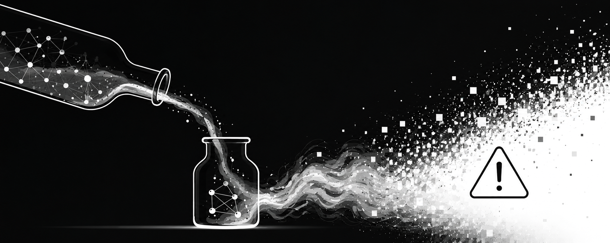

::: {.writeup-page}
[Back to research](index.html#research){.writeup-back .flj}

::: {.distillation-hero}

<div class="distillation-hero-art">
  
</div>

::: {.writeup-meta}
Research note, June 2026 · ⏳ Reading time ~16 minutes
:::

## Why Fast Distillation Can Be Risky for Scientific Imaging Inverse Problems

::: {.writeup-summary}
Diffusion and flow-matching models trained with their original generative objectives give us a model-defined posterior sampling procedure. If the teacher is well trained and sampled accurately, its samples and their Monte Carlo mean can be interpreted as samples and an MMSE estimate under the teacher's learned conditional distribution. After distillation to one to four steps, that guarantee no longer automatically transfers: the student has a new objective, a new sampler, and a new implicit distribution. Its samples need not come from the teacher posterior, and the mean of student samples need not equal the teacher's posterior mean.
:::

:::

::: {.distillation-thesis}
**Core thesis.** Fast distillation is not the problem. The risky assumption is treating a one-step or few-step student as if it were automatically an exact accelerated sampler of the teacher posterior.
:::

::: {.distillation-quick-grid}
::: {.distillation-quick-card}
**Teacher model**

Samples are tied to the original score or flow-matching objective and its sampler.
:::

::: {.distillation-quick-card}
**MSE model**

The optimum is a conditional mean, not a posterior sampler.
:::

::: {.distillation-quick-card}
**Distilled student**

The student defines a new implicit distribution unless posterior preservation is validated.
:::
:::

::: {.writeup-page-toc}
**Contents**

1. [Teacher Models Have a Posterior Interpretation](#teacher-models-have-a-posterior-interpretation)
2. [MSE Models Are Different](#mse-models-are-different)
3. [What Distillation Changes](#what-distillation-changes)
4. [The Main Failure Mode](#the-main-failure-mode)
5. [Student MMSE Is Not Teacher MMSE](#student-mmse-is-not-teacher-mmse)
6. [Why This Matters for Microscopy](#why-this-matters-for-microscopy)
7. [What Should Be Validated](#what-should-be-validated)
8. [Validation Checklist](#validation-checklist)
9. [Examples of Distillation Methods](#examples-of-distillation-methods)
10. [Takeaway](#takeaway)
:::

::: {.distillation-context}
**Context.** This note was prompted by discussions and lectures from the [CVPR 2026 tutorial *Accelerated Diffusion Models: From Theory to Interactive World Models*](https://cvpr26-tutorial-fastgen.github.io/){target="_blank" .flj}, which I attended recently. The tutorial made a strong case for fast diffusion and flow-based generation; this writeup is my attempt to spell out why the same acceleration story needs extra care in scientific imaging inverse problems.
:::

Microscopy restoration is an inverse problem. We observe a degraded measurement $y$ and want to infer an unknown clean biological image $x$. A generic measurement model is

$$
y = \mathcal{D}(x) + \eta,
$$

where $\mathcal{D}$ is the imaging or degradation operator and $\eta$ is measurement noise. In a Bayesian inverse problem, the object we would like to reason about is the posterior

$$
p_{\mathrm{true}}(x \mid y)
\propto
p(y \mid x)p(x).
$$

For microscopy, this posterior matters because a restored image can become evidence for puncta, filaments, membranes, organelle morphology, protein localization, or downstream biological measurements. The question is therefore not only whether an output looks clean. The more important question is whether the output is a faithful sample, or summary, of the conditional distribution supported by the measurement.

## Teacher Models Have a Posterior Interpretation

For conditional diffusion or score-based restoration, the teacher is trained to approximate a conditional score along a noising process:

$$
s_{\theta}(x_t,t,y)
\approx
\nabla_{x_t}\log p_t(x_t \mid y).
$$

Sampling then follows the learned reverse dynamics. Abstractly, if the teacher sampler is accurate, it defines samples

$$
x_T^{(k)}
\sim
p_{\theta}(x \mid y),
$$

where $p_{\theta}(x \mid y)$ is the teacher's learned conditional distribution. Throughout this note, $p_{\theta}(x \mid y)$ denotes the conditional distribution learned by the teacher model. It is a learned approximation to the true inverse-problem posterior, not necessarily the exact Bayesian posterior $p(x \mid y)$. For conditional flow matching, the teacher learns a velocity field

$$
\frac{d x_t}{dt}
=
v_{\theta}(x_t,t,y),
$$

and sampling is obtained by integrating the learned flow from a base distribution to the image distribution. Again, the model defines a conditional distribution:

$$
z^{(k)} \sim p_0(z),
\qquad
x_T^{(k)} = \Phi_{\theta}(z^{(k)},y),
\qquad
x_T^{(k)} \sim p_{\theta}(x \mid y).
$$

This does not mean the teacher posterior is the true posterior. It means the teacher samples are tied to the original training objective and the sampling procedure implied by that objective. If the original model is well trained, well conditioned on $y$, and sampled accurately, then its samples are meaningful samples from the teacher's learned posterior.

The corresponding teacher MMSE estimate is

$$
\mu_{\theta}(y)
=
\mathbb{E}_{p_{\theta}(x\mid y)}[x].
$$

In practice this can be estimated by Monte Carlo sampling:

$$
\hat{\mu}_{\theta}(y)
=
\frac{1}{K}
\sum_{k=1}^{K}
x_T^{(k)},
\qquad
x_T^{(k)} \sim p_{\theta}(x \mid y).
$$

This is the important reason diffusion and flow-matching models are useful for scientific inverse problems: they can provide not just one restoration, but a distribution of plausible restorations and a posterior-mean estimate under the learned teacher model.

::: {.distillation-key-point}
**Why this matters.** The teacher's value is not only image quality. It is the combination of samples, uncertainty, and a posterior-mean estimate defined by the same learned conditional distribution.
:::

## MSE Models Are Different

A standard supervised restoration network trained with pixel-wise MSE solves a different problem:

$$
\mathcal{L}_{\mathrm{MSE}}(\omega)
=
\mathbb{E}_{x,y}
\left[
\left\lVert
f_{\omega}(y)-x
\right\rVert_2^2
\right].
$$

For a fixed $y$, the optimal MSE predictor is

$$
f_{\omega}^{\star}(y)
=
\mathbb{E}[x \mid y].
$$

So an MSE model is usually a conditional-mean estimator, not a posterior sampler. It gives one point estimate:

$$
\hat{x}_{\mathrm{MSE}}(y)
=
f_{\omega}(y).
$$

It does not produce samples

$$
x^{(k)} \sim p(x \mid y)
$$

unless an additional probabilistic mechanism is explicitly introduced. This is not a flaw of MSE; it is exactly what the MSE objective asks for. The problem arises when a conditional mean is interpreted as a posterior sample, or when posterior diversity is scientifically important. This distinction matters because a distilled generative student also produces sample-like outputs, but those outputs are not automatically the same object as either the teacher samples or the MSE point estimate.

::: {.distillation-key-point}
**Clean distinction.** An MSE model estimates a conditional mean. A diffusion or flow teacher samples from a learned conditional distribution. A distilled student can look generative, but its distribution still has to be checked.
:::

## What Distillation Changes

Distillation replaces the original teacher sampling procedure with a fast student, often using one to four steps. A distilled student might be written as

$$
x_S = g_{\phi}(z,y),
\qquad
z \sim p_0(z),
$$

which defines an implicit student distribution

$$
x_S \sim p_{\phi}(x \mid y).
$$

The problem is that the student is not trained with the original diffusion or flow-matching loss. It is trained with a distillation objective, for example

$$
\mathcal{L}_{\mathrm{distill}}(\phi)
=
\mathbb{E}_{z,y,t}
\left[
d
\left(
g_{\phi}(z,y,t),
\Phi_{\theta}(z,y,t)
\right)
\right],
$$

where $\Phi_{\theta}$ is a teacher trajectory, teacher endpoint, or teacher flow map, and $d(\cdot,\cdot)$ is some matching distance. This objective can make the student fast and visually close to the teacher, but it is not the same as the original teacher objective:

$$
\mathcal{L}_{\mathrm{distill}}(\phi)
\neq
\mathcal{L}_{\mathrm{teacher}}(\theta).
$$

Because the student is trained with a different objective and a different sampling map, equality between the student distribution and the teacher distribution is not guaranteed. The student should therefore be treated as defining a new implicit conditional distribution $p_{\phi}(x \mid y)$ unless distributional equivalence has been validated.

The desired statement would be

$$
p_{\phi}(x \mid y)
=
p_{\theta}(x \mid y).
$$

But distillation does not automatically guarantee this. In an idealized setting with enough capacity, perfect optimization, and an exact distillation objective, the student could in principle reproduce the teacher sampler. In practice, it encourages an approximation:

$$
p_{\phi}(x \mid y)
\approx
p_{\theta}(x \mid y),
$$

and the quality of this approximation must be tested.

::: {.distillation-warning}
**Careful reading.** The approximation symbol is doing real work here. Fast generation can be excellent engineering while still changing the posterior quantities that scientific imaging cares about.
:::

## The Main Failure Mode

The central risk is that student samples can look like teacher samples without being distributed like teacher samples:

$$
x_S^{(k)} \sim p_{\phi}(x \mid y)
\quad
\not\Rightarrow
\quad
x_S^{(k)} \sim p_{\theta}(x \mid y).
$$

This matters because posterior sampling is only scientifically useful if the samples represent the right conditional uncertainty. A distilled model may assign reduced probability mass to some regions that are plausible under the teacher, especially under aggressive one-step or few-step distillation. This can appear as mode loss, reduced sample diversity, or biased biological statistics. More precisely, for a biologically relevant statistic $h(x)$:

$$
p_{\phi}(h(x) \in A \mid y)
\neq
p_{\theta}(h(x) \in A \mid y),
$$

where $h(x)$ might be puncta count, filament continuity, organelle morphology, or colocalization score.

Weak conditioning — where the student relies more on the learned image prior and less on the actual observation — can sometimes be detected by reduced dependence between generated samples and measurements, for example through diagnostics related to the mutual information $I(X;Y)$. However, mutual information should be treated as one possible diagnostic rather than a theorem: a model can depend strongly on $y$ and still be wrong.

This is exactly where hallucination enters. A sample can be plausible under the student distribution while not being a faithful sample from the teacher posterior:

$$
x_S \sim p_{\phi}(x \mid y),
\qquad
p_{\theta}(x_S \mid y)
\text{ may be small.}
$$

For scientific imaging, that is dangerous. The output may look biologically realistic while no longer being a valid sample from the posterior distribution learned by the original teacher model.

::: {.distillation-danger}
**Main risk.** The student can produce images that are visually plausible, biologically familiar, and still posterior-inconsistent.
:::

## Student MMSE Is Not Teacher MMSE

The same issue applies to posterior means. The teacher posterior mean is

$$
\mu_{\theta}(y)
=
\mathbb{E}_{p_{\theta}(x\mid y)}[x].
$$

The student sample mean is

$$
\mu_{\phi}(y)
=
\mathbb{E}_{p_{\phi}(x\mid y)}[x].
$$

Even if the student and teacher distributions differ, their means could in principle coincide. However, unless the student is explicitly constrained or validated to preserve the teacher expectation, there is no automatic guarantee that

$$
\mu_{\phi}(y)
=
\mu_{\theta}(y).
$$

With finite samples,

$$
\hat{\mu}_{\phi}(y)
=
\frac{1}{K}
\sum_{k=1}^{K}
x_S^{(k)},
\qquad
x_S^{(k)} \sim p_{\phi}(x\mid y),
$$

is an estimate of the student mean, not the teacher mean. The gap is

$$
\left\lVert
\mu_{\phi}(y)-\mu_{\theta}(y)
\right\rVert.
$$

This gap can be scientifically meaningful. Even if individual student samples look sharp, averaging student samples recovers the mean of the student distribution, $\mathbb{E}_{p_{\phi}}[x \mid y]$, not automatically the MMSE estimate of the original teacher model.

::: {.distillation-key-point}
**Mean of what?** Averaging student samples estimates the student mean. It is only a teacher MMSE estimate if the student distribution preserves the teacher distribution closely enough for that purpose.
:::

## Why This Matters for Microscopy

In microscopy, generated structure can become biological evidence. If a distilled model does not preserve the teacher's conditional distribution, it may change the scientific interpretation: different uncertainty, different mean, different conclusions.

The student can fail in ways that are not the same as classical MSE blur:

$$
\text{MSE ambiguity}
\longrightarrow
\text{conditional averaging},
$$

whereas

$$
\text{distilled generative ambiguity}
\longrightarrow
\text{plausible but posterior-inconsistent samples}.
$$

The second failure mode is harder to notice because the image may be sharp, realistic, and visually convincing.

::: {.distillation-warning}
**In microscopy, sharp is not enough.** The restored image may become evidence for a biological claim, so the right question is not only whether it looks clean, but whether it remains measurement-conditioned in the right way.
:::

## What Should Be Validated

For a distilled model, visual similarity to teacher outputs is not enough. The relevant question is whether the student preserves the teacher's learned conditional distribution:

$$
p_{\phi}(x\mid y)
\approx
p_{\theta}(x\mid y).
$$

Useful checks include comparing teacher and student sample statistics:

$$
\left\lVert
\hat{\mu}_{\phi}(y)-\hat{\mu}_{\theta}(y)
\right\rVert,
\qquad
\left\lVert
\widehat{\operatorname{Var}}_{\phi}(x\mid y)
-
\widehat{\operatorname{Var}}_{\theta}(x\mid y)
\right\rVert.
$$

One should also test whether the student preserves measurement dependence:

$$
p_{\phi}(x\mid y)
\neq
p_{\phi}(x\mid \tilde{y})
\quad
\text{when}
\quad
y \neq \tilde{y},
$$

and whether generated samples remain consistent with the measurement model. When a forward model is known, student and teacher samples should be checked for consistency. If your model allows computing or approximating the likelihood, this can be written as a likelihood-based residual:

$$
r(x;y)
=
-\log p(y \mid x),
$$

which reduces to the squared residual $\|\mathcal{D}(x)-y\|^2$ in the Gaussian-noise special case. In microscopy, where Poisson noise, heteroscedastic noise, unknown PSFs, or detector nonlinearities are common, the likelihood-based form is often more appropriate.

If the teacher provides slower but trusted samples, a distilled model should be evaluated against those samples not only by visual quality, but by posterior-level quantities:

$$
\mathbb{E}_{p_{\phi}}[h(x)]
\approx
\mathbb{E}_{p_{\theta}}[h(x)]
$$

for biologically relevant measurements $h$, such as object count, intensity, filament length, puncta density, colocalization, or morphology.

Distillation is not inherently invalid. A distilled model may be acceptable if it is validated for the intended scientific use. The key point is that visual similarity or standard reconstruction metrics are insufficient when the output is interpreted probabilistically. One should validate the student against the teacher and, where possible, against ground-truth or measurement-model-based criteria.

## Validation Checklist

For a teacher distribution $p_{\theta}(x \mid y)$ and a student distribution $p_{\phi}(x \mid y)$, the following checks are recommended:

::: {.validation-grid}
::: {.validation-card}
**1. Sample mean**

Compare $\mathbb{E}_{p_{\phi}}[x \mid y]$ vs. $\mathbb{E}_{p_{\theta}}[x \mid y]$.
:::

::: {.validation-card}
**2. Uncertainty maps**

Compare $\operatorname{Var}_{p_{\phi}}(x \mid y)$ vs. $\operatorname{Var}_{p_{\theta}}(x \mid y)$.
:::

::: {.validation-card}
**3. Biological statistics**

Compare the distributions of biologically relevant statistics:

$$
p_{\phi}(h(x) \mid y)
\quad \text{vs.} \quad
p_{\theta}(h(x) \mid y),
$$

where $h(x)$ could be puncta count, filament length, organelle shape, colocalization, or cell morphology.
:::

::: {.validation-card}
**4. Measurement consistency**

Compare the likelihood-based residuals, if your model allows computing or approximating the likelihood:

$$
-\log p(y \mid x_S)
\quad \text{vs.} \quad
-\log p(y \mid x_T).
$$
:::

::: {.validation-card}
**5. Calibration**

Check whether nominal credible intervals or uncertainty estimates have the expected empirical coverage.
:::

::: {.validation-card}
**6. Diversity and mode coverage**

Use ensemble statistics, distributional distances, or downstream biological measurements to check whether the student has collapsed to a subset of teacher-like outputs.
:::
:::

::: {.distillation-key-point}
**Practical rule.** Validate the distilled model against the quantities you plan to interpret, not only against perceptual quality or reconstruction metrics.
:::

## Examples of Distillation Methods

To make the discussion above concrete, this section briefly describes several prominent distillation approaches. Each replaces the teacher sampling procedure in a different way, and each introduces a different student objective that is not the original teacher loss. The question of whether $p_{\phi}(x \mid y) \approx p_{\theta}(x \mid y)$ must be asked separately for each.

::: {.method-card}
### Consistency Models

Consistency models (Song et al., 2023) enforce a self-consistency property: the student must map every point along a teacher ODE trajectory to the same clean output. The training objective is

$$
\mathcal{L}_{\mathrm{CM}}(\phi)
=
\mathbb{E}_{x,t,t'}
\left[
d\!\left(
f_{\phi}(x_t, t),\;
f_{\phi}(x_{t'}, t')
\right)
\right],
$$

where $t' < t$ are two time steps along the same probability flow ODE trajectory, and $d$ is a distance metric. The student learns to jump from any noise level directly to the clean image in one step. This removes all intermediate sampling steps, but the student's implicit distribution is shaped by the consistency constraint rather than the original score-matching objective. Consistency distillation produces one-step or few-step generators with high visual quality, but the student output distribution $p_{\phi}(x \mid y)$ is not constrained to match the teacher posterior in terms of calibrated uncertainty or mode coverage.
:::

::: {.method-card}
### Flow Matching Distillation and Flow Maps

In flow matching, the teacher defines a velocity field $v_{\theta}(x_t, t, y)$ and samples are obtained by numerically integrating this ODE. Distillation replaces the multi-step integration with a student that directly parameterizes a flow map:

$$
x_S = g_{\phi}(z, y),
\qquad
z \sim \mathcal{N}(0, I),
$$

trained to match teacher endpoints:

$$
\mathcal{L}_{\mathrm{FM\text{-}distill}}(\phi)
=
\mathbb{E}_{z, y}
\left[
\left\lVert
g_{\phi}(z, y) - \Phi_{\theta}(z, y)
\right\rVert^2
\right],
$$

where $\Phi_{\theta}(z, y)$ is the result of integrating the teacher flow from noise $z$ to the image. The student learns to replicate the input–output map of the teacher ODE solver in a single forward pass. Reflow (Liu et al., 2023) iteratively straightens the flow trajectories so that fewer Euler steps suffice; the distilled student then approximates the straightened map. The student's distribution again depends on how well a finite-capacity network can approximate a potentially complex, multi-modal flow map.
:::

::: {.method-card}
### Progressive Distillation

Progressive distillation (Salimans & Ho, 2022) halves the number of sampling steps in each round. A student is trained to match in one step what the teacher does in two:

$$
\mathcal{L}_{\mathrm{prog}}(\phi)
=
\mathbb{E}_{x_t, t}
\left[
\left\lVert
f_{\phi}(x_t, t) - \mathrm{TwoStep}_{\theta}(x_t, t)
\right\rVert^2
\right],
$$

where $\mathrm{TwoStep}_{\theta}$ denotes two DDIM steps of the teacher. After several rounds ($N \to N/2 \to N/4 \to \cdots$), the model generates in very few steps. Each round introduces an approximation error, and these errors compound. The student at the final round may be several distributional approximations removed from the original teacher posterior.
:::

::: {.method-card}
### Adversarial Distillation

Adversarial distillation (e.g., SDXL-Turbo / ADD, Sauer et al., 2023) adds a GAN-style discriminator to the distillation process:

$$
\mathcal{L}_{\mathrm{adv}}(\phi)
=
\mathcal{L}_{\mathrm{distill}}(\phi)
+
\lambda\,\mathcal{L}_{\mathrm{GAN}}(\phi, \psi),
$$

where $\psi$ parameterizes a discriminator that distinguishes student outputs from real images. The adversarial term pushes student samples toward the manifold of realistic images, which can improve perceptual quality. However, mode dropping is a well-known GAN failure mode, and the adversarial objective actively trades distributional coverage for sample sharpness. This makes the posterior-preservation question especially pressing for scientific applications.
:::

::: {.method-card}
### Score Distillation

Score distillation sampling (SDS; Poole et al., 2023) and its variants use a pretrained diffusion model as a critic to guide optimization of a different representation (e.g., a NeRF or a single image). The gradient signal is derived from the teacher score:

$$
\nabla_{\phi}\mathcal{L}_{\mathrm{SDS}}
=
\mathbb{E}_{t,\epsilon}
\left[
w(t)\left(
\hat{\epsilon}_{\theta}(x_t; t, y) - \epsilon
\right)
\frac{\partial x}{\partial \phi}
\right],
$$

where $x = g_\phi(\cdot)$ is the student's parameterized output and $\hat{\epsilon}_\theta$ is the teacher's noise prediction. SDS does not produce posterior samples at all; it produces a single mode-seeking output. Variational score distillation (VSD; Wang et al., 2024) addresses some of these issues by maintaining a student score model, but the resulting distribution is still shaped by the variational objective rather than the original teacher posterior.
:::

Each of these methods achieves substantial speedups, but each introduces a different relationship between $p_{\phi}(x \mid y)$ and $p_{\theta}(x \mid y)$, and none guarantees distributional equivalence by construction. For natural-image generation, any gap may be acceptable. For scientific imaging, the gap must be measured and understood.

## Takeaway

The issue is not that diffusion or flow-matching models are untrustworthy. The opposite is closer to the point: when trained and sampled with their original objectives, they give a principled learned posterior sampling procedure.

A distilled sampler should not automatically be interpreted as a faster implementation of the teacher posterior. The teacher defines a learned conditional distribution $p_{\theta}(x \mid y)$, while the distilled student defines another implicit conditional distribution $p_{\phi}(x \mid y)$. Even when the student is trained to match teacher trajectories, teacher outputs, or consistency constraints, equality $p_{\phi}(x \mid y) = p_{\theta}(x \mid y)$ is not guaranteed:

$$
p_{\theta}(x\mid y)
\quad
\xrightarrow{\text{distillation}}
\quad
p_{\phi}(x\mid y).
$$

The arrow is not a proof of equality. It is an approximation that must be validated.

So the core message is:

$$
x_S^{(k)} \sim p_{\phi}(x\mid y)
\quad
\not\Rightarrow
\quad
x_S^{(k)} \sim p_{\theta}(x\mid y),
$$

and averaging student samples estimates $\mathbb{E}_{p_{\phi}}[x \mid y]$, not necessarily $\mathbb{E}_{p_{\theta}}[x \mid y]$:

$$
\frac{1}{K}\sum_{k=1}^{K}x_S^{(k)}
\quad
\not\Rightarrow
\quad
\mathbb{E}_{p_{\theta}(x\mid y)}[x].
$$

The danger is not distillation itself. The danger is treating a distilled one-step or few-step model as if it preserved the teacher's conditional distribution by construction. In scientific inverse problems, this assumption can affect uncertainty estimates, posterior means, biological measurements, and downstream conclusions. Distilled models can be useful, but they should be validated as new probabilistic models rather than accepted as exact accelerated samplers of the teacher.

::: {.distillation-final}
**Bottom line.** Use distilled models, but validate them as new probabilistic models. Speed is valuable only if the quantities you report still mean what you think they mean.
:::

::: {.citation-block}
## Citation

If you use or refer to this note, you can cite it as:

Ray, Anirban. "Why Fast Distillation Can Be Risky for Scientific Imaging Inverse Problems." 2026. https://rayanirban.github.io/distillation_dangers.html

```bibtex
@misc{ray2026distillation_dangers,
  author = {Ray, Anirban},
  title = {Why Fast Distillation Can Be Risky for Scientific Imaging Inverse Problems},
  year = {2026},
  url = {https://rayanirban.github.io/distillation_dangers.html},
  note = {Research note}
}
```
:::

::: {.writeup-social}
## Feedback and discussion

<div class="writeup-social-row">
<div class="writeup-feedback-item">
<p class="writeup-social-intro">
Feedback from [Sander Dieleman](https://x.com/sedielem){target="_blank" .flj} and my response:
</p>

<div class="writeup-twitter-embed">
  <blockquote class="twitter-tweet" data-theme="dark" data-dnt="true" data-conversation="none">
    <p lang="en" dir="ltr">Loading comment...</p>
    <a href="https://twitter.com/sedielem/status/2065722900338851938">View the comment on X</a>
  </blockquote>
</div>
</div>

<div class="writeup-discussion-cta">
  <p>For broader discussion, add your thoughts on the original post:</p>

  <p class="writeup-social-action">
    <a href="https://twitter.com/anirbanray_/status/2065715816700543103" class="writeup-twitter-button" target="_blank" rel="noopener">Share your thoughts on X</a>
  </p>
  <p class="writeup-social-action">
    <a href="https://www.linkedin.com/feed/update/urn:li:activity:7472206004844351488/" class="writeup-twitter-button" target="_blank" rel="noopener">Share your thoughts on LinkedIn</a>
  </p>  
</div>
</div>

<script async src="https://platform.twitter.com/widgets.js" charset="utf-8"></script>
:::

:::
