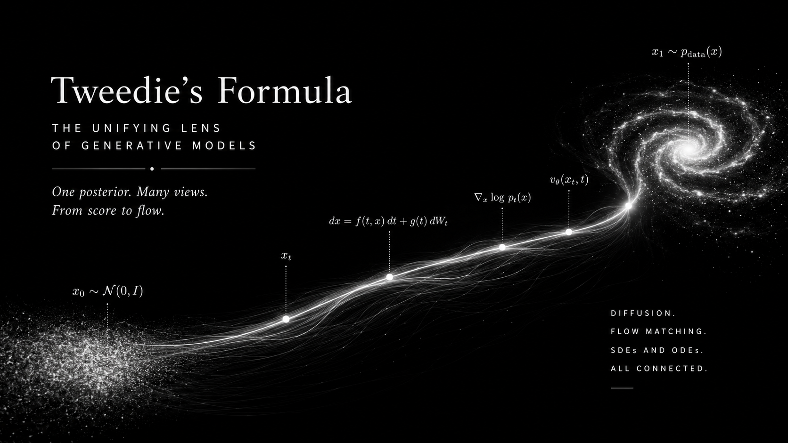
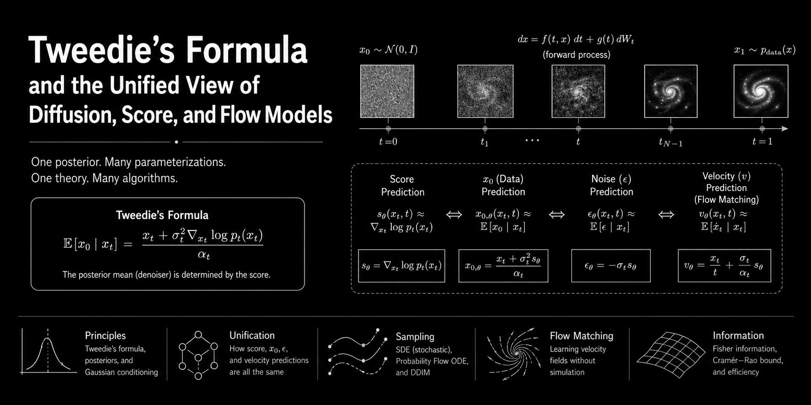

::: {.writeup-page .generative-note}
[Back to research](index.html#research){.writeup-back .flj}

::: {.distillation-hero}

  

::: {.writeup-meta}
Research note, July 2026 · Reading time ~18 minutes
:::

## Tweedie's Formula as the Rosetta Stone of Score Matching, Diffusion, DDIM, and CFM

::: {.writeup-summary}
A mathematical walk from empirical Bayes denoising to modern generative modeling: score matching, diffusion $x_0$-, $\epsilon$-, $v$-prediction, DDIM, reverse SDEs, probability-flow ODEs, and conditional flow matching.
:::

:::

::: {.distillation-thesis}
**Core thesis.** Tweedie's formula says that denoising, score estimation, noise prediction, velocity prediction, DDIM transport, and CFM vector fields are different coordinate systems for the same posterior geometry induced by Gaussian corruption.
:::

::: {.distillation-quick-grid}
::: {.distillation-quick-card}
**Posterior denoising**

The central object is $\mathbb E[x_0 \mid x_t]$, the clean posterior mean under Gaussian corruption.
:::

::: {.distillation-quick-card}
**Score geometry**

The score is the correction field that moves noisy points toward that posterior mean.
:::

::: {.distillation-quick-card}
**Sampler coordinates**

Diffusion heads, DDIM, reverse SDEs, ODEs, and CFM velocities reuse the same geometry.
:::
:::

::: {.writeup-page-toc}
**Contents**

1. [The Central Question](#setup)
2. [Deriving Tweedie's Formula](#derive)
3. [Interactive: Tweedie Denoising](#interactive1)
4. [Prediction Heads](#param)
5. [Diffusion v-Prediction](#vpv)
6. [Conditional Flow Matching](#cfm)
7. [DDIM](#ddim)
8. [Reverse SDE vs Probability-Flow ODE](#sdeode)
9. [Fisher Information](#fisher)
10. [Summary](#summary)
11. [Overall Map](#overall-map)
12. [References](#refs)
:::

## The Central Question {#setup}

Suppose the world gives us clean data $x_0 \sim p_0(x_0)$, but we only observe a noised version

::: {.eqbox}
$$
x_t = \alpha_t x_0 + \sigma_t \epsilon,
\qquad
\epsilon\sim\mathcal N(0,I).
$$
:::

Diffusion models, score models, DDIM samplers, and flow matching models differ in how they parameterize the neural network and how they sample. But at the heart of all of them is one posterior object:

::: {.eqbox}
$$
\mathbb E[x_0\mid x_t].
$$
:::

**Tweedie's formula** says that this posterior denoised estimate can be written using the *marginal score* $s_t(x_t)=\nabla_{x_t}\log p_t(x_t)$:

::: {.eqbox}
$$
\boxed{
\mathbb E[x_0\mid x_t]
=
\frac{x_t+\sigma_t^2\nabla_{x_t}\log p_t(x_t)}{\alpha_t}.
}
$$
:::

The rest of this note is just unpacking this one identity until many seemingly different objectives become the same object in different coordinates.

## Deriving Tweedie's Formula {#derive}

Let

::: {.eqbox}
$$
p_t(x_t\mid x_0)=\mathcal N(x_t;\alpha_t x_0,\sigma_t^2 I).
$$
:::

The marginal noisy density is

::: {.eqbox}
$$
p_t(x_t)=\int p_t(x_t\mid x_0)p_0(x_0)\,dx_0.
$$
:::

Take the score of the marginal:

::: {.eqbox}
$$
\nabla_{x_t}\log p_t(x_t)
=
\frac{\nabla_{x_t}p_t(x_t)}{p_t(x_t)}.
$$
:::

Move the derivative inside the integral:

::: {.eqbox}
$$
\nabla_{x_t}p_t(x_t)
=
\int \nabla_{x_t}p_t(x_t\mid x_0)p_0(x_0)\,dx_0.
$$
:::

For the Gaussian conditional,

::: {.eqbox}
$$
\nabla_{x_t}\log p_t(x_t\mid x_0)
=
-\frac{x_t-\alpha_t x_0}{\sigma_t^2}.
$$
:::

Therefore

::: {.eqbox}
$$
\nabla_{x_t}\log p_t(x_t)
=
\mathbb E\left[
-\frac{x_t-\alpha_t x_0}{\sigma_t^2}
\,\middle|\,x_t
\right].
$$
:::

Since $x_t$ is fixed inside the conditional expectation,

::: {.eqbox}
$$
\nabla_{x_t}\log p_t(x_t)
=
-\frac{x_t-\alpha_t\mathbb E[x_0\mid x_t]}{\sigma_t^2}.
$$
:::

Rearrange:

::: {.eqbox}
$$
\boxed{
\mathbb E[x_0\mid x_t]
=
\frac{x_t+\sigma_t^2s_t(x_t)}{\alpha_t}.
}
$$
:::

::: {.distillation-key-point}
**Interpretation.** The score is not merely a gradient field for sampling. It is also the correction term that moves a noisy point toward its posterior clean mean.

$$
\mathbb E[x_0\mid x_t]-\frac{x_t}{\alpha_t}
=
\frac{\sigma_t^2}{\alpha_t}s_t(x_t).
$$
:::

<section id="interactive1" class="plot-card">

<h2>Interactive Plot 1: Tweedie Denoising in 1D</h2>

We use a one-dimensional mixture prior. Move the observation $y=x_t$ and noise level $\sigma$ to see the posterior mean $\mathbb E[x_0\mid y]$, the marginal score, and Tweedie's identity.

  
<label>Observation $y$ </label><input id="obs" type="range" min="-6" max="6" step="0.01" value="1.2">

  
<label>Noise $\sigma$ </label><input id="sigma" type="range" min="0.15" max="3" step="0.01" value="0.9">

<canvas id="plotTweedie" width="980" height="360"></canvas>

<i class="sw s1"></i>marginal $p_t(y)$<i class="sw s2"></i>score $\nabla_y\log p_t(y)$<i class="sw s3"></i>Tweedie posterior mean

</section>

## The Same Estimator in Different Diffusion Parameterizations {#param}

Modern diffusion papers often choose different neural-network outputs. But if the forward noising process is Gaussian, these outputs are algebraically convertible.

::: {.eqbox}
$$
x_t=\alpha_t x_0+\sigma_t\epsilon,
\qquad
\epsilon\sim\mathcal N(0,I).
$$
:::

<table>
<thead><tr><th>Parameterization</th><th>What the network learns</th><th>Tweedie interpretation</th><th>Implied score</th></tr></thead>
<tbody>
<tr><td>$x_0$-prediction</td><td>$x_\theta(x_t,t)\approx x_0$</td><td>$x_\theta\approx\mathbb E[x_0\mid x_t]$</td><td>$s_\theta=\dfrac{\alpha_t x_\theta-x_t}{\sigma_t^2}$</td></tr>
<tr><td>$\epsilon$-prediction</td><td>$\epsilon_\theta(x_t,t)\approx\epsilon$</td><td>$\epsilon_\theta\approx\mathbb E[\epsilon\mid x_t] = -\sigma_t s_t(x_t)$</td><td>$s_\theta=-\dfrac{\epsilon_\theta}{\sigma_t}$</td></tr>
<tr><td>score prediction</td><td>$s_\theta(x_t,t)\approx\nabla_{x_t}\log p_t(x_t)$</td><td>directly learns Tweedie correction field</td><td>$s_\theta$</td></tr>
<tr><td>$v$-prediction</td><td>$v_\theta$ in an orthogonal coordinate system</td><td>learns a rotation of clean and noise posteriors</td><td>see below</td></tr>
</tbody>
</table>

### Noise Prediction Is Posterior Residual Prediction

From the forward equation,

::: {.eqbox}
$$
\mathbb E[\epsilon\mid x_t]
=
\frac{x_t-\alpha_t\mathbb E[x_0\mid x_t]}{\sigma_t}.
$$
:::

Plug in Tweedie:

::: {.eqbox}
$$
\boxed{
\mathbb E[\epsilon\mid x_t]= -\sigma_t s_t(x_t).
}
$$
:::

So $\epsilon$-prediction is not arbitrary. It is a scaled score prediction.

## Diffusion v-Prediction: A Rotation of Clean and Noise {#vpv}

A common continuous-time convention writes

::: {.eqbox}
$$
x_t=\alpha_t x_0+\sigma_t\epsilon,
\qquad
\alpha_t^2+\sigma_t^2=1.
$$
:::

The velocity-style diffusion target is often

::: {.eqbox}
$$
v_t=\alpha_t\epsilon-\sigma_t x_0.
$$
:::

This is a rotation of $(x_0,\epsilon)$. The inverse rotation is

::: {.eqbox}
$$
\boxed{x_0=\alpha_t x_t-\sigma_t v_t},
\qquad
\boxed{\epsilon=\sigma_t x_t+\alpha_t v_t}.
$$
:::

Taking conditional expectations gives the Tweedie interpretation:

::: {.eqbox}
$$
v_\theta(x_t,t)
\approx
\mathbb E[v_t\mid x_t]
=
\alpha_t\mathbb E[\epsilon\mid x_t]
-\sigma_t\mathbb E[x_0\mid x_t].
$$
:::

Using $\mathbb E[\epsilon\mid x_t]= -\sigma_t s_t$ and Tweedie for $\mathbb E[x_0\mid x_t]$,

::: {.eqbox}
$$
\boxed{
v_t^{\star}(x_t)
=
-\frac{\sigma_t}{\alpha_t}x_t
-\frac{\sigma_t}{\alpha_t}s_t(x_t)
}
\quad
\text{when }\alpha_t^2+\sigma_t^2=1.
$$
:::

More usefully, the conversions are:

::: {.eqbox}
$$
\boxed{\hat x_0=\alpha_t x_t-\sigma_t v_\theta},
\qquad
\boxed{\hat\epsilon=\sigma_t x_t+\alpha_t v_\theta},
\qquad
\boxed{s_\theta=-\frac{\sigma_t x_t+\alpha_t v_\theta}{\sigma_t}}.
$$
:::

::: {.distillation-warning}
**Notation warning.** Diffusion $v$-prediction and CFM velocity prediction are related in spirit but not the same object. Diffusion $v$ is usually a rotation of clean/noise variables; CFM velocity is a path derivative $\dot x_t$.
:::

<section class="plot-card">
<h2>Interactive Plot 2: Convert One Prediction Head into All Others</h2>

Choose $t$ and a scalar noisy point. We use a simple VP schedule $\alpha=\cos(\frac{\pi t}{2})$, $\sigma=\sin(\frac{\pi t}{2})$ and an analytic mixture score. The table updates all equivalent outputs.

  
<label>Diffusion time $t$ </label><input id="timeParam" type="range" min="0.02" max="0.98" step="0.001" value="0.45">

  
<label>Noisy point $x_t$ </label><input id="xtParam" type="range" min="-5" max="5" step="0.01" value="1.5">

<canvas id="plotParam" width="980" height="360"></canvas>

</section>

## Conditional Flow Matching through the Same Lens {#cfm}

For the simple Gaussian-to-data linear interpolation used in many CFM explanations, write

::: {.eqbox}
$$
x_t=(1-t)x_0+t x_1,
$$
:::

where $x_0\sim\mathcal N(0,I)$ is noise and $x_1\sim p_{\text{data}}$ is clean data. This is the same Gaussian corruption form, just with the clean endpoint called $x_1$:

::: {.eqbox}
$$
x_t=t x_1+(1-t)\epsilon,
\qquad
\alpha_t=t,
\quad
\sigma_t=1-t.
$$
:::

Tweedie gives the clean endpoint posterior:

::: {.eqbox}
$$
\boxed{
\mathbb E[x_1\mid x_t]
=
\frac{x_t+(1-t)^2s_t(x_t)}{t}.
}
$$
:::

The CFM target velocity is the conditional mean path derivative:

::: {.eqbox}
$$
u_t(x_t)
=
\mathbb E[\dot x_t\mid x_t]
=
\mathbb E[x_1-x_0\mid x_t].
$$
:::

Because $x_0=(x_t-tx_1)/(1-t)$,

::: {.eqbox}
$$
x_1-x_0=\frac{x_1-x_t}{1-t}.
$$
:::

Therefore

::: {.eqbox}
$$
\boxed{
u_t(x_t)
=
\frac{\mathbb E[x_1\mid x_t]-x_t}{1-t}.
}
$$
:::

Plug in Tweedie:

::: {.eqbox}
$$
\boxed{
u_t(x_t)=\frac{x_t}{t}+\frac{1-t}{t}s_t(x_t)
},
\qquad
\boxed{
s_t(x_t)=\frac{t u_t(x_t)-x_t}{1-t}.
}
$$
:::

And the endpoints implied by a CFM velocity are

::: {.eqbox}
$$
\boxed{\hat x_1=x_t+(1-t)u_t(x_t)},
\qquad
\boxed{\hat x_0=x_t-t u_t(x_t)}.
$$
:::

::: {.distillation-key-point}
**CFM interpretation.** CFM velocity prediction learns the posterior mean displacement from the noise endpoint to the clean endpoint. Score matching learns the same thing after a time-dependent affine change of coordinates.
:::

## DDIM as Deterministic Posterior-Mean Transport {#ddim}

In DDPM, the reverse process is usually stochastic. DDIM showed that one can construct a non-Markovian reverse process with the same training objective but deterministic or partially stochastic sampling. The key practical formula starts from a predicted clean estimate $\hat x_0$ and predicted noise $\hat\epsilon$:

::: {.eqbox}
$$
\hat x_0=
\frac{x_t-\sqrt{1-\bar\alpha_t}\,\epsilon_\theta(x_t,t)}
{\sqrt{\bar\alpha_t}},
\qquad
\hat\epsilon=\epsilon_\theta(x_t,t).
$$
:::

The deterministic DDIM step from time $t$ to $s<t$ is

::: {.eqbox}
$$
\boxed{
x_s=
\sqrt{\bar\alpha_s}\,\hat x_0
+
\sqrt{1-\bar\alpha_s}\,\hat\epsilon.
}
$$
:::

Through Tweedie, $\hat x_0$ is a posterior clean mean, while $\hat\epsilon=-\sigma_t s_t$ is a posterior residual/score estimate. DDIM therefore reuses the same estimated clean/noise coordinates and moves them to a lower noise level.

<section class="plot-card">
<h3>Interactive Plot 3: Deterministic DDIM vs Stochastic Reverse Steps</h3>

This toy 1D plot uses the analytic score of a mixture distribution. Deterministic paths are smooth; stochastic paths add fresh noise during reverse sampling.

  
<label>Start noise seed </label><input id="seedSlider" type="range" min="1" max="99" step="1" value="17">

  
<label>Stochasticity $\eta$ </label><input id="etaSlider" type="range" min="0" max="1" step="0.01" value="0.45">

<canvas id="plotDDIM" width="980" height="360"></canvas>

<i class="sw s1"></i>DDIM / ODE-like path<i class="sw s5"></i>stochastic reverse path

</section>

## Reverse SDE vs Probability-Flow ODE {#sdeode}

The score-SDE framework starts from a forward SDE

::: {.eqbox}
$$
dx=f(x,t)dt+g(t)dW_t.
$$
:::

The reverse-time SDE is

::: {.eqbox}
$$
\boxed{
dx=
\left[
f(x,t)-g(t)^2\nabla_x\log p_t(x)
\right]dt
+
g(t)d\bar W_t,
}
$$
:::

where time is run backward. The probability-flow ODE has the same marginal densities $p_t$ but no Brownian noise:

::: {.eqbox}
$$
\boxed{
dx=
\left[
f(x,t)-\frac{1}{2}g(t)^2\nabla_x\log p_t(x)
\right]dt.
}
$$
:::

Both require the same score. Tweedie tells us that this score is equivalent to a posterior denoiser. Thus:

<table>
<thead><tr><th>Sampler</th><th>Uses</th><th>Same marginal path?</th><th>Intuition</th></tr></thead>
<tbody>
<tr><td>Reverse SDE</td><td>score + stochastic noise</td><td>Yes</td><td>remove noise while injecting calibrated randomness</td></tr>
<tr><td>Probability-flow ODE</td><td>score only</td><td>Yes</td><td>deterministic transport through same marginals</td></tr>
<tr><td>DDIM with $\eta=0$</td><td>predicted $\hat x_0$, $\hat\epsilon$</td><td>discrete deterministic analogue</td><td>moves in clean/noise coordinates</td></tr>
<tr><td>CFM ODE</td><td>velocity field $u_t$</td><td>depends on chosen path</td><td>learns deterministic vector field directly</td></tr>
</tbody>
</table>

## Fisher Information: The Energy of the Score Field {#fisher}

The Fisher information of the noisy marginal is

::: {.eqbox}
$$
\mathcal I(t)
=
\mathbb E_{x_t\sim p_t}
\left[
\|\nabla_{x_t}\log p_t(x_t)\|^2
\right].
$$
:::

In Gaussian denoising, Tweedie gives

::: {.eqbox}
$$
s_t(x_t)
=
\frac{\alpha_t\mathbb E[x_0\mid x_t]-x_t}{\sigma_t^2}
=
-\frac{\mathbb E[\epsilon\mid x_t]}{\sigma_t}.
$$
:::

So Fisher information measures how much posterior residual information remains in $x_t$. Large score norm means the noisy marginal has sharp structure; small score norm means the distribution is closer to a broad Gaussian.

::: {.distillation-key-point}
**Useful identity.** For Gaussian noise corruption $Y=X+\sigma Z$, de Bruijn's identity links entropy growth to Fisher information:

$$
\frac{d}{d\tau}h(X+\sqrt{\tau}Z)
=
\frac{1}{2}\mathcal I(X+\sqrt{\tau}Z).
$$

As you inject Gaussian noise, entropy increases at a rate controlled by Fisher information. This is one reason Fisher information naturally appears in score-based generative modeling.
:::

<section class="plot-card">
<h3>Interactive Plot 4: Fisher Information vs Noise</h3>

For the same 1D mixture prior, we numerically integrate $\mathcal I(\sigma)=\mathbb E[s_\sigma(Y)^2]$. Larger noise smooths the distribution and usually reduces sharp score structure.

<label>Highlighted $\sigma$ </label><input id="fishSlider" type="range" min="0.15" max="3" step="0.01" value="0.9">

<canvas id="plotFisher" width="980" height="360"></canvas>

</section>

## The Whole Unification in One Table {#summary}

<table>
<thead><tr><th>View</th><th>Network target</th><th>Tweedie meaning</th><th>Conversion to score</th></tr></thead>
<tbody>
<tr><td>Score matching</td><td>$s_\theta$</td><td>learns correction toward posterior mean</td><td>$s_\theta$</td></tr>
<tr><td>Diffusion $x_0$-prediction</td><td>$x_\theta$</td><td>$\mathbb E[x_0\mid x_t]$</td><td>$\dfrac{\alpha_t x_\theta-x_t}{\sigma_t^2}$</td></tr>
<tr><td>Diffusion $\epsilon$-prediction</td><td>$\epsilon_\theta$</td><td>$\mathbb E[\epsilon\mid x_t]$</td><td>$-\dfrac{\epsilon_\theta}{\sigma_t}$</td></tr>
<tr><td>Diffusion $v$-prediction</td><td>$v_\theta=\alpha_t\epsilon-\sigma_t x_0$</td><td>rotated posterior clean/noise coordinate</td><td>$-\dfrac{\sigma_t x_t+\alpha_t v_\theta}{\sigma_t}$, for VP convention</td></tr>
<tr><td>DDIM</td><td>$\hat x_0,\hat\epsilon$ reused across times</td><td>deterministic movement in Tweedie clean/noise coordinates</td><td>same as $x_0$ or $\epsilon$ prediction</td></tr>
<tr><td>Reverse SDE</td><td>$s_\theta$</td><td>stochastic denoising dynamics</td><td>direct</td></tr>
<tr><td>Probability-flow ODE</td><td>$s_\theta$</td><td>deterministic transport with same marginals</td><td>direct</td></tr>
<tr><td>CFM velocity</td><td>$u_\theta\approx\mathbb E[\dot x_t\mid x_t]$</td><td>posterior mean endpoint displacement</td><td>for $x_t=(1-t)x_0+t x_1$: $\dfrac{t u_\theta-x_t}{1-t}$</td></tr>
</tbody>
</table>

::: {.distillation-final}
**One-sentence takeaway.** Tweedie's formula turns many generative-modeling objects into translations of a single posterior-denoising identity.
:::

## Overall Map {#overall-map}

{.writeup-figure}

## References and Further Reading {#refs}

1. Jonathan Ho, Ajay Jain, Pieter Abbeel. *Denoising Diffusion Probabilistic Models*, NeurIPS 2020. [arXiv:2006.11239](https://arxiv.org/abs/2006.11239){target="_blank" .flj}.
2. Jiaming Song, Chenlin Meng, Stefano Ermon. *Denoising Diffusion Implicit Models*, ICLR 2021. [arXiv:2010.02502](https://arxiv.org/abs/2010.02502){target="_blank" .flj}.
3. Yang Song, Jascha Sohl-Dickstein, Diederik P. Kingma, Abhishek Kumar, Stefano Ermon, Ben Poole. *Score-Based Generative Modeling through Stochastic Differential Equations*, ICLR 2021. [arXiv:2011.13456](https://arxiv.org/abs/2011.13456){target="_blank" .flj}.
4. Yaron Lipman, Ricky T. Q. Chen, Heli Ben-Hamu, Maximilian Nickel, Matthew Le. *Flow Matching for Generative Modeling*, ICLR 2023. [arXiv:2210.02747](https://arxiv.org/abs/2210.02747){target="_blank" .flj}.
5. Alexandre Thiery. *Reverse Diffusions, Score and Tweedie*. [Blog note](https://alexxthiery.github.io/posts/reverse_and_tweedie/reverse_and_tweedie.html){target="_blank" .flj}.
6. For recent generalizations: *Tweedie's Formulae and Diffusion Generative Models Beyond Gaussian*. [arXiv:2605.19391](https://arxiv.org/abs/2605.19391){target="_blank" .flj}.

::: {.generative-footer}
The plots are toy one-dimensional examples; the identities above hold in vector form with the same algebra.
:::

:::
