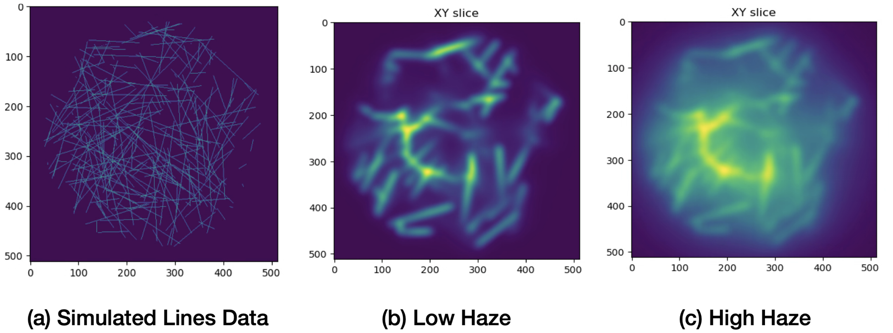
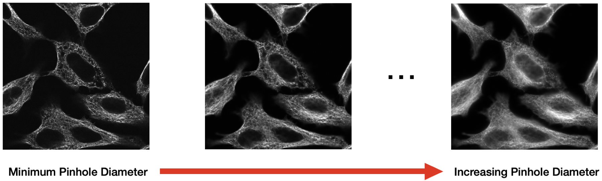
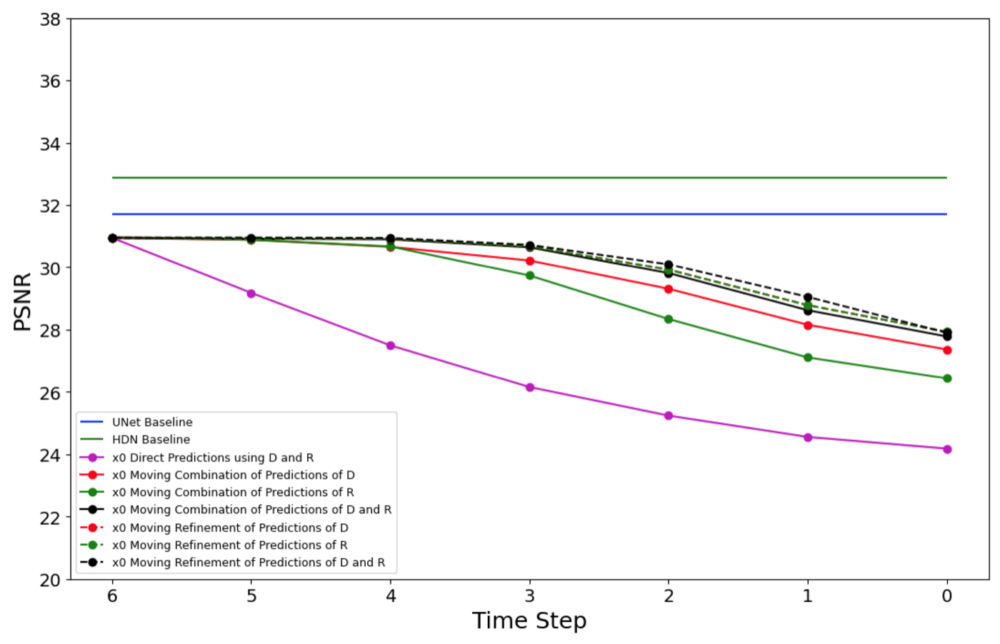
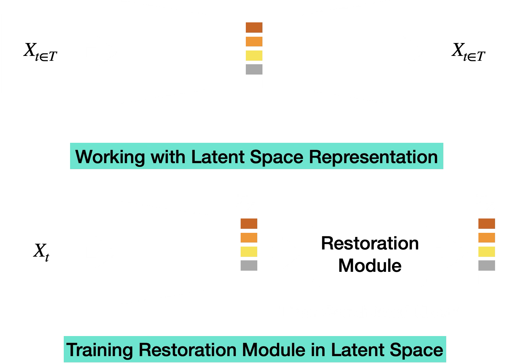
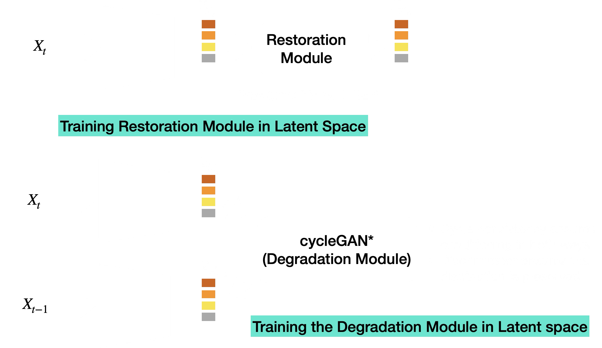
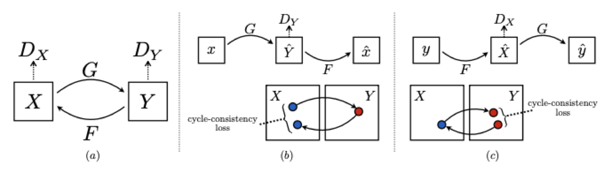
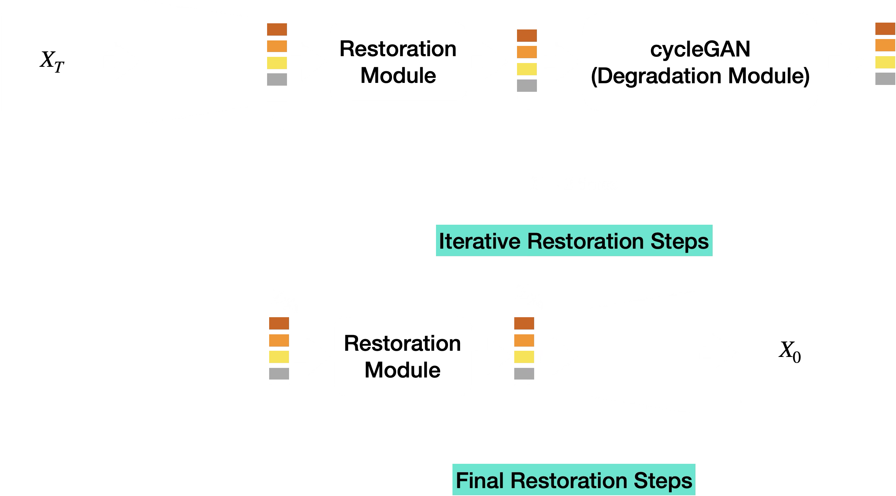
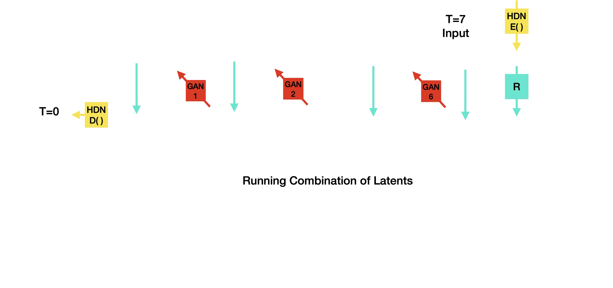
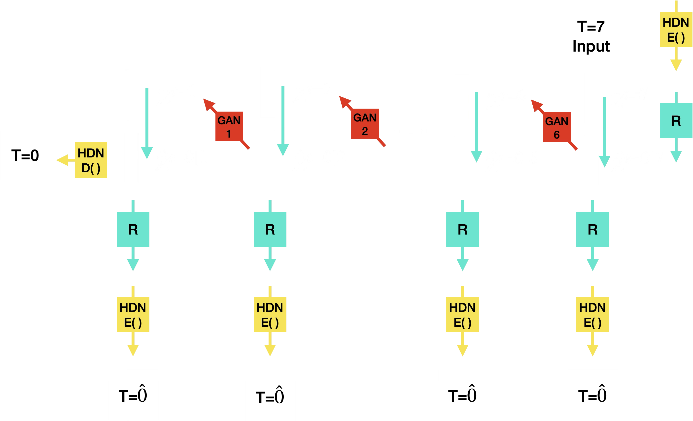
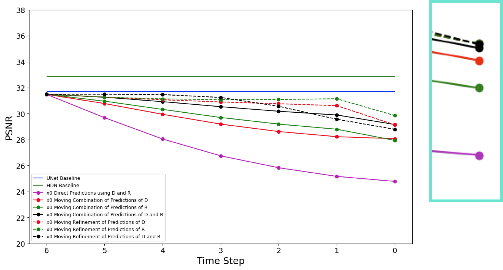

::: {.writeup-page}
[Back to research](index.html#research){.writeup-back .flj}

# Widefield Microscopy Image Dehazing using Diffusion Models in Latent Space

::: {.writeup-meta}
Early PhD exploration, 2024
:::

::: {.writeup-summary}
This was an early attempt to make microscopy dehazing less blurry by moving from one-shot pixel-space restoration toward an iterative latent-space procedure. The project started with pixel-space degradation and restoration, used those results as baselines, and then moved into the latent space of a hierarchical variational autoencoder to learn cleaner iterative dynamics. The latent-space approach did not outperform the direct UNet or HDN baselines, but it clarified why learning degradation dynamics was unstable.
:::

## Motivation

Widefield microscopy collects light from a full specimen area at once, which is useful for fast or long time-lapse imaging. The cost is haze: out-of-focus light from planes above and below the focal plane reaches the detector and reduces the visibility of fine structures. A standard supervised restoration model can map a hazy image to a cleaner one, but when trained with an $L_2$ objective it tends to learn an MMSE estimate:

$$
\hat{x}_{\mathrm{MMSE}}(y) = \mathbb{E}[x \mid y].
$$

That conditional average can look plausible while washing out high-frequency detail. In microscopy, those details may be exactly the structures that matter for downstream biological analysis.

{.writeup-figure fig-align="center"}

## Pixel-Space Setup

The project began in pixel space. The initial intuition was to define a sequence of progressively degraded observations and train a restoration model directly on image intensities. If $x_0$ is the clean image and $n$ is a noise or haze endpoint, one simple forward process can be written as:

$$
x_t = (1 - \alpha_t)x_0 + \alpha_t n,
\qquad
\alpha_t \in [0, 1],
\qquad
t = 0,\ldots,T.
$$

A restoration network can then be trained to predict the clean image from any degradation level:

$$
\mathcal{L}_{R}^{\mathrm{pixel}}(\theta)
=
\mathbb{E}_{x,t}
\left[
\left\lVert
x_0 - R_{\theta}(x_t, t)
\right\rVert_2^2
\right].
$$

For synthetic noise this kind of iterative path is easy to define. For real widefield haze it is harder, because the degradation operator is not known analytically and may depend on microscope configuration, sample geometry, and acquisition settings.

At this stage, everything still lived in image space:

$$
x_t
\xrightarrow{R_{\theta}^{\mathrm{pixel}}(\cdot,t)}
\hat{x}_{0|t}.
$$

This gave a clean first setup for asking whether iterative restoration could avoid the regression-to-the-mean behavior of one-shot supervised restoration.

## Step-Wise Hazy Data

The project therefore used two sources of step-wise degraded data. First, a simulator produced synthetic line structures under increasing haze by changing the pinhole setting. This gave controlled pairs across degradation levels.

{.writeup-figure fig-align="center"}

Second, real microscope acquisitions were made by imaging the same field of view while progressively opening the pinhole. Smaller pinholes gave cleaner confocal-like images; larger pinholes introduced stronger out-of-focus haze.

{.writeup-figure fig-align="center"}

## Pixel-Space Baseline Result

The first comparison used direct pixel-space baselines as the reference point. A UNet was trained to map degraded images $x_{t \in [1,T]}$ to the clean endpoint $x_0$, and HDN was used as a stronger generative baseline. These models operated in one step:

$$
\hat{x}_0
=
R_{\theta}^{\mathrm{pixel}}(x_t,t).
$$

This result made the main tension clear. The one-shot baselines were strong in PSNR, but the restoration objective still encouraged conditional averaging. In the plot below, the horizontal UNet and HDN lines are the pixel-space reference performance; the iterative curves are the later experiments discussed after the latent-space setup. The next question was whether an iterative formulation could preserve more structure without drifting away from the data distribution.

{.writeup-figure fig-align="center"}

## Why Move to Latent Space

Working directly in pixel space made the degradation dynamics difficult to learn. Haze is not just additive noise; it is shaped by the optical path, pinhole setting, sample geometry, and out-of-focus light. A learned step-wise degradation operator in raw pixels therefore had to model both image content and microscope-specific blur/haze at the same time.

The next stage of the project moved the iterative procedure into a compact multiresolution representation. The hope was that a hierarchical latent space would make the degradation trajectory smoother and easier to model than raw images.

## Latent-Space Setup

The next step was to move restoration into the latent space of a hierarchical variational autoencoder (HVAE). The latent representation was split into multiresolution groups:

$$
z = \{z_1,\ldots,z_n\}.
$$

The hierarchical prior and approximate posterior were modeled as:

$$
p_{\theta}(z)
=
p_{\theta}(z_n)
\prod_{i=1}^{n-1}
p_{\theta}(z_i \mid z_{j>i}),
$$

$$
q_{\phi}(z \mid x)
=
q_{\phi}(z_n \mid x)
\prod_{i=1}^{n-1}
q_{\phi,\theta}(z_i \mid z_{j>i}, x).
$$

The HVAE loss combined reconstruction with KL terms across the hierarchy:

$$
\mathcal{L}_{V_{\phi,\theta}}
=
\mathcal{L}^{\mathrm{rec}}_{\phi,\theta}(x)
+
D_{\mathrm{KL}}
\left(
q_{\phi}(z_n \mid x)
\;\Vert\;
p_{\theta}(z_n)
\right)
+
\sum_{i=1}^{n-1}
\mathbb{E}_{q_{\phi}(z_{j>i}\mid x)}
\left[
D_{\mathrm{KL}}
\left(
q_{\phi,\theta}(z_i \mid z_{j>i}, x)
\;\Vert\;
p_{\theta}(z_i \mid z_{j>i})
\right)
\right].
$$

Once the HVAE was trained, the restoration model operated on latents instead of pixels. The full latent-space formulation is shown below: both clean and degraded observations are encoded into HVAE latents, and a time-conditional restoration module predicts the clean latent from a degraded latent.

{.writeup-figure fig-align="center"}

Using $E_\phi(\cdot)$ for the HVAE encoder, the paired latent variables were:

$$
z_0 = E_\phi(x_0),
\qquad
z_t = E_\phi(x_t).
$$

The restoration module $R_{\theta_R}$ was trained to predict:

$$
\hat{z}_{0|t}
=
R_{\theta_R}(z_t,t).
$$

The corresponding latent restoration objective was:

$$
\theta_R^{\star}
=
\operatorname*{arg\,min}_{\theta_R}
\mathbb{E}_{x,t}
\left[
\left\lVert
z_0
-
R_{\theta_R}(z_t, t)
\right\rVert_2^2
\right].
$$

Here $x_t$ could come from the simulator sequence or from the microscope pinhole sequence.

## Learning the Degradation Operator

The iterative procedure also needed a learned degradation step in latent space. After the restoration model predicted an approximate clean latent, the degradation model had to map it to the next less-degraded latent:

$$
X_t = \{\hat{z}_{0|t}\},
\qquad
Y_t = \{z_{t-1}\}.
$$

The proposed setup used a CycleGAN-style pair of mappings for each degradation step:

$$
G_{\psi}^{(t)}: X_t \to Y_t,
\qquad
F_{\omega}^{(t)}: Y_t \to X_t.
$$

{.writeup-figure fig-align="center"}

The objective combined adversarial, cycle-consistency, and cosine-similarity terms to discourage latent drift:

$$
\mathcal{L}_{D_\psi}^{(t)}
=
\mathcal{L}_{\mathrm{GAN}}(G_{\psi}^{(t)},D_Y^{(t)},X_t,Y_t)
+
\mathcal{L}_{\mathrm{GAN}}(F_{\omega}^{(t)},D_X^{(t)},Y_t,X_t)
+
\lambda_{\mathrm{cyc}}\mathcal{L}_{\mathrm{cyc}}^{(t)}
+
\lambda_{\mathrm{cos}}\mathcal{L}_{\mathrm{cos}}^{(t)}.
$$

The adversarial part was optimized as:

$$
\operatorname*{arg\,min}_{\psi,\omega}
\operatorname*{arg\,max}_{D_X,D_Y}
\mathcal{L}_{D_\psi}^{(t)}.
$$

{.writeup-figure fig-align="center"}

## Iterative Inference

At inference time, the intended loop alternated between restoration and learned degradation until it reached the clean endpoint:

{.writeup-figure fig-align="center"}

The inference algorithm can be written with the same latent notation:

$$
z_T = E_\phi(x_T).
$$

For each step $t = T,T-1,\ldots,1$:

$$
\hat{z}_{0|t} = R_{\theta_R}(z_t,t).
$$

If $t>1$, the learned degradation operator produced the next latent on the trajectory:

$$
z_{t-1} = D_{\psi}^{(t)}(\hat{z}_{0|t}).
$$

At the final step, the clean latent was decoded back to image space:

$$
\hat{x}_0 = \operatorname{Dec}_{\theta}(z_0).
$$

The important assumption was that every learned degradation step would keep the latent on the correct data manifold. In practice, small errors accumulated across steps, and the predicted latents drifted.

## Latent-Space Variants and Final Result

After the latent-space setup was in place, the final experiments compared UNet and HDN baselines with several variants of the proposed iterative latent system. Some variants used direct predictions from the restoration and degradation networks; others tried moving combinations or iterative refinements of those predictions.

One drift-control idea was to convexly combine a newly predicted latent with a previous latent on the trajectory. If

$$
\tilde{z}_{t-1}
=
D_{\psi}^{(t)}(\hat{z}_{0|t}),
$$

then a running latent update could be written as:

$$
z_{t-1}^{\mathrm{comb}}
=
\alpha_t \tilde{z}_{t-1}
+
(1-\alpha_t)z_t.
$$

The same idea was also tested on clean-latent predictions:

$$
\hat{z}_{0|t-1}^{\mathrm{comb}}
=
\alpha_t R_{\theta_R}(\tilde{z}_{t-1},t-1)
+
(1-\alpha_t)\hat{z}_{0|t}.
$$

{.writeup-figure fig-align="center"}

Another variant repeatedly refined the intermediate predictions by alternating restoration, HVAE encoding/decoding, and the learned degradation modules. This tested whether repeated projection through the HVAE and restoration model could stabilize the latent trajectory.

{.writeup-figure fig-align="center"}

{.writeup-figure fig-align="center"}

The result was useful but negative. Chronologically, the project went from pixel-space baselines to a latent-space iterative formulation, but the learned latent degradation model was still not reliable enough to support repeated stepping. The iterative variants generally trailed the one-shot baselines. The main takeaways were:

- Pixel-space baselines were hard to beat, even though they still carried the risk of conditional averaging.
- The learned latent degradation operator was the weakest part of the system.
- Naive convex combinations of latents did not prevent drift.
- Cycle-consistency helped formulate the problem but did not make the mapping stable enough.
- The HVAE representation remained interesting, especially for multiresolution uncertainty, but the project needed a stronger generative restoration formulation.

This line of work eventually fed into later microscopy restoration projects where the generative model is trained more directly around the conditional restoration task instead of requiring a separately learned degradation loop.
:::
