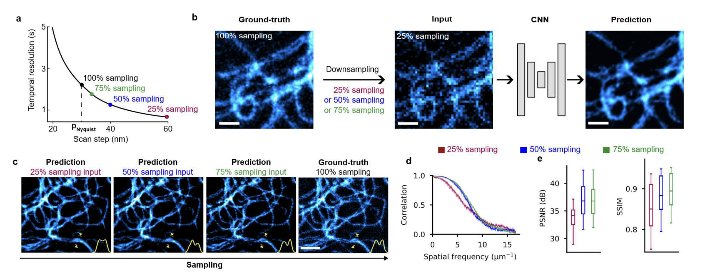
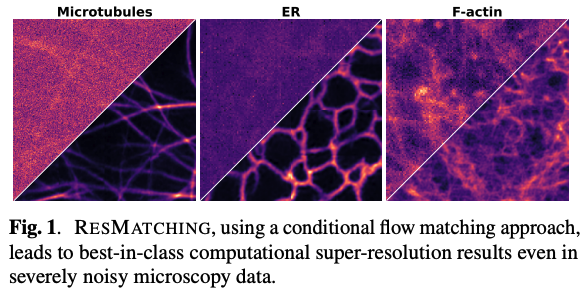
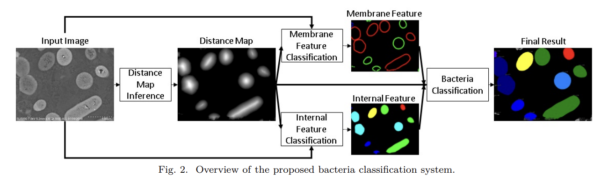
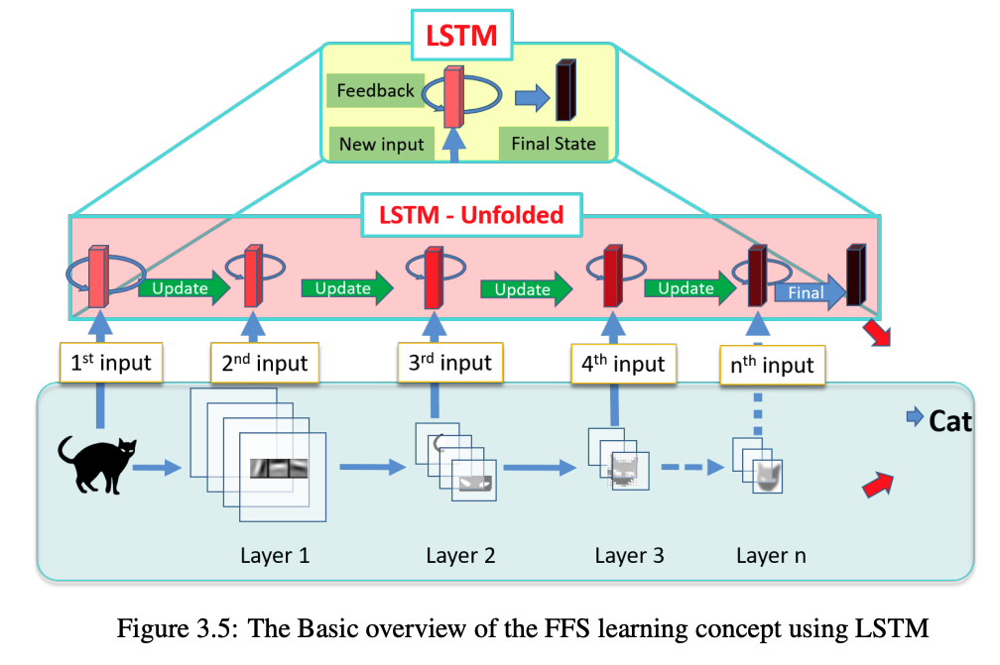

### Current Research (PhD, 2022–Present)

::: {.project-item}

**RESOLFT time lapse imaging empowered by deep learning**  
[Guillaume Minet](https://www.testalab.org/people.php){target="_blank" .flj}, [Anirban Ray](https://rayanirban.github.io/){target="_blank" .flj}, Francesca Pennacchietti, Giovanna Coceano, [Florian Jug](https://humantechnopole.it/en/people/florian-jug/){target="_blank" .flj}, and [Ilaria Testa](https://www.testalab.org/){target="_blank" .flj}  

{fig-align="center" width="80%" alt="RESOLFT time lapse imaging empowered by deep learning"}

Deep learning extended RESOLFT nanoscopy by restoring low-SNR and sub-sampled acquisitions, enabling 5× longer imaging with 10× lower dose of light per frame, or a 4× increase in imaging speed for faster live-cell imaging while preserving ~60 nm resolution. This method enables reduced photobleaching and accelerated volumetric recording, revealing previously inaccessible sub-organelle dynamics in living cells. 
[Preprint (under review)](https://www.researchsquare.com/article/rs-8059028/v1){target="_blank" .flj} | <a href="files/RESOLFT.png" target="_blank" class="flj">AI Generated infographic</a> 
:::

::: {.project-item}

**ResMatching: Noise-Resilient Computational Super-Resolution via Guided Conditional Flow Matching**  
[Anirban Ray](https://rayanirban.github.io/){target="_blank" .flj}, [Vera Galinova](https://humantechnopole.it/en/people/vera-galinova/){target="_blank" .flj}, and [Florian Jug](https://humantechnopole.it/en/people/florian-jug/){target="_blank" .flj} 
{fig-align="center" width="80%" alt="ResMatching: Noise-Resilient Computational Super-Resolution via Guided Conditional Flow Matching"}

A guided conditional flow-matching framework for noise-resilient computational super-resolution in fluorescence microscopy, unifying denoising, super-resolution, uncertainty estimation, and posterior sampling within a single generative model. 
<!-- [GitHub](#){target="_blank" .flj} | -->
[Paper (arXiv)](https://arxiv.org/abs/2510.26601){target="_blank" .flj} | [Project Page](https://rayanirban.github.io/resmatching/){target="_blank" .flj} | <a href="files/RM.png" target="_blank" class="flj">AI Generated infographic</a> 
:::

::: {.project-item}

**HazeMatching: Conditional Flow Matching for Microscopy Dehazing**  
[Anirban Ray](https://rayanirban.github.io/){target="_blank" .flj}, [Ashesh](https://ashesh-0.github.io/){target="_blank" .flj}, and [Florian Jug](https://humantechnopole.it/en/people/florian-jug/){target="_blank" .flj}   
{fig-align="center" width="80%" alt="HazeMatching: Conditional Flow Matching for microscopy dehazing"}

A generative framework that restores optical microscopy images degraded by scattering and haze using Conditional Flow Matching (CFM). HazeMatching models the mapping between widefield and confocal modalities, enabling clearer visualization of biological structures. 
<!-- [GitHub](#){target="_blank" .flj} | -->
[Paper (arXiv)](https://arxiv.org/abs/2506.22397){target="_blank" .flj} | 
<!-- [Project Page](#){target="_blank"} | -->
<a href="files/HM.png" target="_blank" class="flj">AI Generated infographic</a> 
:::

### Past Research (Hitachi Ltd., 2018–2021)

::: {.project-item}
**Deep Learning for Microscopy Image Analysis**  

From 2018 to 2021, my research at [Hitachi Ltd., Tokyo](https://www.hitachi.com/rd/){target="_blank" .flj} focused on developing deep learning–based systems for high-precision image understanding in biomedical microscopy. I worked on combining computer vision and AI-driven automation for identifying and quantifying objects of interest in complex visual data.

**Publications:**

- [*Quantitative Analysis System for Bacterial Cells in SEM Images Using Deep Learning*](https://ieeexplore.ieee.org/abstract/document/9400322){target="_blank" .flj} (*CISS 2021*) — introduced a neural architecture for accurate segmentation and counting of bacterial cells from scanning electron microscopy (SEM) data. | <a href="files/HitPaper2.png" target="_blank" class="flj">AI Generated infographic</a> 
- [*Deep Learning Based Bacteria Classification from SEM Images Using a Combination of Membrane and Internal Features*](https://ieeexplore.ieee.org/abstract/document/9751170){target="_blank" .flj} (*CISS 2022*) — improved bacterial classification by jointly modeling morphological and internal structural cues. | <a href="files/HitPaper1.png" target="_blank" class="flj">AI Generated infographic</a> 

**Patents:**

- [US Patent 12327363](https://patents.google.com/patent/US12327363B2){target="_blank" .flj} — methods and apparatuses for generating neural models that identify and segment objects of interest from images. | <a href="files/USP2.png" target="_blank" class="flj">AI Generated infographic</a> 
- [US Patent 12211213](https://patents.google.com/patent/US12211213B2){target="_blank" .flj} — adaptive feature extraction and object detection for microscopy imaging. | <a href="files/USP1.png" target="_blank" class="flj">AI Generated infographic</a> 
- [EP Patent 3961562A1](https://patents.google.com/patent/EP3961562A1){target="_blank" .flj} — AI image-processing systems for industrial and microscopy applications. | <a href="files/EP.png" target="_blank" class="flj">AI Generated infographic</a> 

This phase of my work established a foundation in AI-driven visual understanding, bridging industrial automation with quantitative biological imaging, and set the stage for my later research in generative and flow-based models for microscopy restoration.

{width="100%" style="border-radius: 1rem; box-shadow: 0 0 10px rgba(0,0,0,0.1);"}
:::

### Past Research (Masters Thesis, 2016–2018)
::: {.project-item}
**Modeling the Feature Evolution in CNNs using LSTM**  
{fig-align="center" width="80%" alt="Modeling the Feature Evolution in CNNs using LSTM"}

During my master's studies at [Nagoya Institute of Technology](https://www.nitech.ac.jp/eng/){target="_blank" .flj}, Japan (2018), I explored the temporal dynamics of feature representations in Convolutional Neural Networks (CNNs) using Long Short-Term Memory (LSTM) networks. My research focused on understanding how features evolve across layers in CNNs and leveraging LSTMs to model these transitions for improved image classification performance. Read more about it in my [thesis.](https://drive.google.com/file/d/1A7Gm2RS3L8SPyb9G9Ey5O350kh7DYZKk/view?usp=sharing){target="_blank".flj} | <a href="files/Thesis.png" target="_blank" class="flj">AI Generated infographic</a> 
:::

  (Note that AI Generated infographics are representational only)

