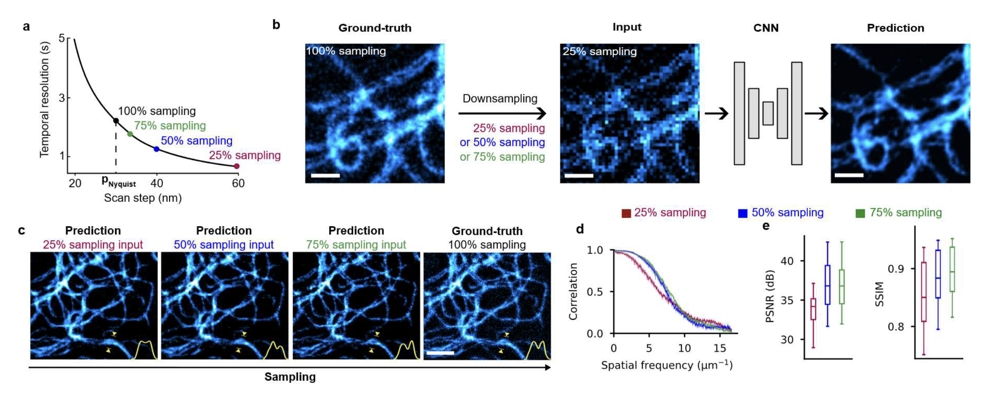
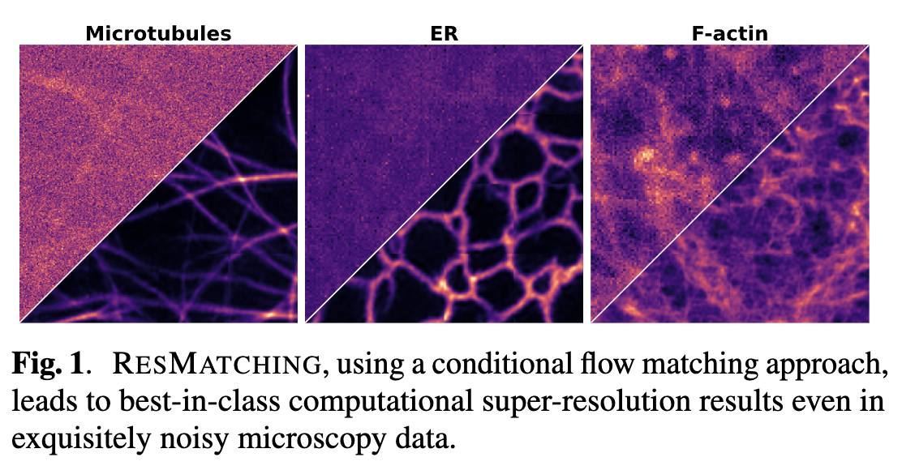
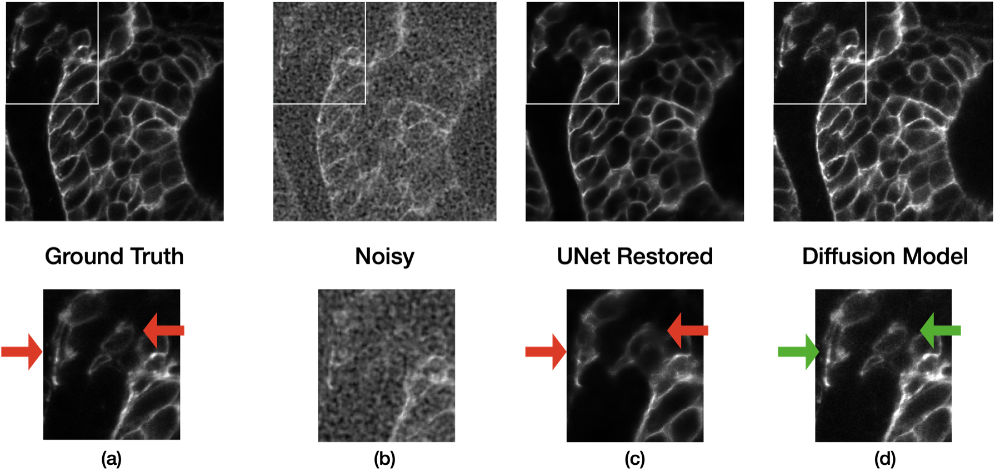
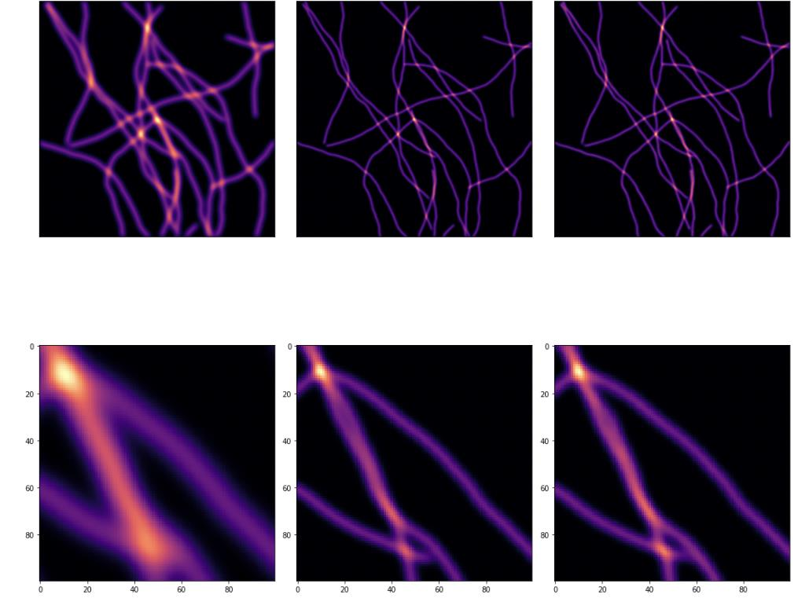
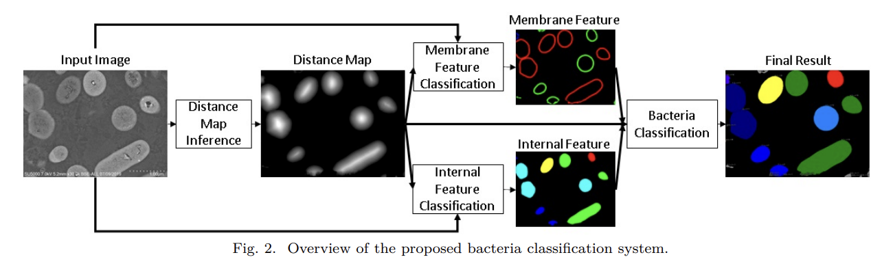
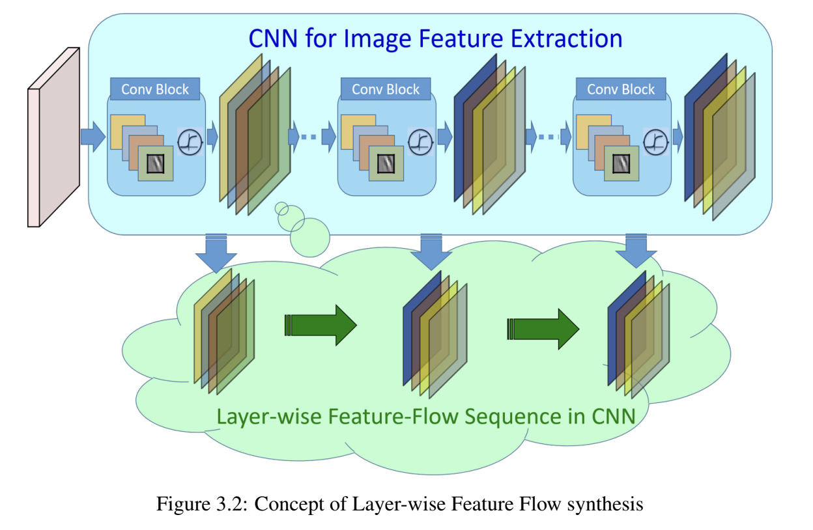

```{=html}
<div class="research-topic-index" aria-label="Research topic list">
<div class="research-topic-index__header">
  <span class="research-topic-index__eyebrow">Research map</span>
  <strong>Jump to a topic</strong>
</div>

<div class="research-topic-list">
  <a href="#phd-work" class="research-topic-link">
    <span class="research-topic-number">01</span>
    <span class="research-topic-main">
      <span class="research-topic-title">Current Research (PhD, 2022–Present)</span>
      <span class="research-topic-meta">Current microscopy restoration work with flow matching and deep learning</span>
    </span>
    <span class="research-topic-tag">2022-present</span>
  </a>
  <a href="#phd-did-not-work" class="research-topic-link">
    <span class="research-topic-number">02</span>
    <span class="research-topic-main">
      <span class="research-topic-title">Things that didn’t work earlier in the PhD</span>
      <span class="research-topic-meta">Earlier ideas, negative results, and lessons that shaped the later work</span>
    </span>
    <span class="research-topic-tag">Notes</span>
  </a>
  <a href="#hitachi-research" class="research-topic-link">
    <span class="research-topic-number">03</span>
    <span class="research-topic-main">
      <span class="research-topic-title">Past Research (Hitachi Ltd., 2018–2021)</span>
      <span class="research-topic-meta">Deep learning for SEM image analysis, classification, and patents</span>
    </span>
    <span class="research-topic-tag">2018-2021</span>
  </a>
  <a href="#masters-research" class="research-topic-link">
    <span class="research-topic-number">04</span>
    <span class="research-topic-main">
      <span class="research-topic-title">Past Research (Masters Thesis, 2016–2018)</span>
      <span class="research-topic-meta">Modeling feature evolution in CNNs using LSTM</span>
    </span>
    <span class="research-topic-tag">2016-2018</span>
  </a>
</div>
</div>
```

### Current Research (PhD, 2022–Present) {#phd-work}

::: {#resolft-time-lapse .project-item}

**<span style="font-size: 1.2em;">RESOLFT time lapse imaging empowered by deep learning</span>**  
[Guillaume Minet](https://www.testalab.org/people.php){target="_blank" .flj}, [Anirban Ray](https://rayanirban.github.io/){target="_blank" .flj}, Francesca Pennacchietti, Giovanna Coceano, [Florian Jug](https://humantechnopole.it/en/people/florian-jug/){target="_blank" .flj}, and [Ilaria Testa](https://www.testalab.org/){target="_blank" .flj}</br> 

{fig-align="center" width="80%" alt="RESOLFT time lapse imaging empowered by deep learning"}

Deep learning extended RESOLFT nanoscopy by restoring low-SNR and sub-sampled acquisitions, enabling 5× longer imaging with 10× lower dose of light per frame, or a 4× increase in imaging speed for faster live-cell imaging while preserving ~60 nm resolution. This method enables reduced photobleaching and accelerated volumetric recording, revealing previously inaccessible sub-organelle dynamics in living cells.</br>
[Preprint (under review)](https://www.researchsquare.com/article/rs-8059028/v1){target="_blank" .flj} | [GitHub](https://github.com/GuillaumeMinet/deepL_resolft){target="_blank" .flj} | <span class="infographic-wrapper"><a href="files/RESOLFT.png" target="_blank" class="flj">AI Generated infographic</a> </span>
:::

::: {#resmatching .project-item}

**<span style="font-size: 1.2em;">ResMatching: Noise-Resilient Computational Super-Resolution via Guided Conditional Flow Matching [ [IEEE ISBI 2026 (Oral)] ](https://biomedicalimaging.org/2026/){target="_blank" .flj}</span>**  
[Anirban Ray](https://rayanirban.github.io/){target="_blank" .flj}, [Vera Galinova](https://humantechnopole.it/en/people/vera-galinova/){target="_blank" .flj}, and [Florian Jug](https://humantechnopole.it/en/people/florian-jug/){target="_blank" .flj}</br>
<!-- {fig-align="center" width="80%" alt="ResMatching: Noise-Resilient Computational Super-Resolution via Guided Conditional Flow Matching"} -->
<table style="width:100%; margin:auto; border:none; border-collapse:collapse;"><tr>
<td style="border:none; text-align:center; padding:0.5rem;"></td>
<td style="border:none; text-align:center; padding:0.5rem;"></td>
</tr></table>
A guided conditional flow-matching framework for noise-resilient computational super-resolution in fluorescence microscopy, unifying denoising, super-resolution, uncertainty estimation, and posterior sampling within a single generative model.</br>
[GitHub](https://github.com/juglab/resmatching){target="_blank" .flj} |
[Paper (arXiv)](https://arxiv.org/abs/2510.26601){target="_blank" .flj} | [Project Page](https://rayanirban.github.io/resmatching/){target="_blank" .flj} | <span class="infographic-wrapper"><a href="files/RM.png" target="_blank" class="flj">AI Generated infographic</a> </span>
:::

::: {#hazematching .project-item}

**<span style="font-size: 1.2em;">HazeMatching: Conditional Flow Matching for Microscopy Dehazing [ [CVPR 2026 (Findings)] ](https://cvpr.thecvf.com/){target="_blank" .flj}</span>**  
[Anirban Ray](https://rayanirban.github.io/){target="_blank" .flj}, [Ashesh](https://ashesh-0.github.io/){target="_blank" .flj}, and [Florian Jug](https://humantechnopole.it/en/people/florian-jug/){target="_blank" .flj}.</br>  
<table style="width:100%; margin:auto; border:none; border-collapse:collapse;"><tr>
<td style="border:none; text-align:center; padding:0.5rem;"></td>
<td style="border:none; text-align:center; padding:0.5rem;"></td>
</tr></table>

A generative framework that restores optical microscopy images degraded by scattering and haze using Conditional Flow Matching (CFM). HazeMatching models the mapping between widefield and confocal modalities, enabling clearer visualization of biological structures. This work was addtionally accepted as a poster to the [Computer Vision for Science (CV4Science) Workshop 2026](https://sites.google.com/nyu.edu/computervisionforscience){target="_blank" .flj} at [CVPR 2026](https://cvpr.thecvf.com/){target="_blank" .flj}. This project includes a microscopy dehazing dataset of paired widefield and confocal images, which we are releasing to the community to support further research in this area.</br>
[GitHub](https://github.com/juglab/HazeMatching){target="_blank" .flj} |
[Paper (arXiv)](https://arxiv.org/abs/2506.22397){target="_blank" .flj} | 
<!-- [Project Page](#){target="_blank"} | -->
<span class="infographic-wrapper"><a href="files/HM.png" target="_blank" class="flj">AI Generated infographic</a> </span>
:::

### Things that didn't work earlier in the PhD {#phd-did-not-work}

::: {.research-note}
These ideas did not turn into papers, but they were not wasted. I am sharing them because failed directions often make the useful parts of research visible: the assumptions, experiments, and lessons that shaped what came next.

The wavelet project taught me that structured or interpretable representations are not automatically better if the model must also learn the inverse mapping. The latent dehazing work taught a related lesson about avoiding extra pipeline complexity unless it really improves restoration. Both lessons influenced HazeMatching and ResMatching, where I moved toward generative formulations that can model plausible restorations while staying grounded in microscopy.
:::

::: {#latent-diffusion-dehazing .project-item}

**<span style="font-size: 1.2em;">Widefield Microscopy Image Dehazing using Diffusion Models in Latent Space | 2023</span>**  
[Anirban Ray](https://rayanirban.github.io/){target="_blank" .flj}</br>

{fig-align="center" width="100%" alt="Latent diffusion dehazing: regression-to-the-mean motivation and iterative restoration"}

An earlier attempt at microscopy dehazing before HazeMatching. I tried to avoid regression-to-the-mean blur by replacing one-shot restoration with an iterative latent-space procedure: encode hazy images with a hierarchical VAE, predict clean latents, then learn a degradation operator that could step the latent back through progressively lower haze levels.

The learned latent degradation step was unstable and the iterative variants did not beat direct UNet/HDN baselines. I kept the research-panel version short here; the full note includes the cleaned-up equations, figures, CycleGAN-style degradation formulation, and failure analysis.</br>
[Read the full write-up](latent-diffusion-dehazing.html){target="_blank" .flj} | <span class="infographic-wrapper"><a href="files/USP_CycleGAN.png" target="_blank" class="flj">AI Generated infographic</a> </span>
:::

::: {#dewam-wavelet-model .project-item}

**<span style="font-size: 1.2em;">DeWaM: Deconvolution Wavelet Model for Microscopy Image Restoration | 2022</span>**  
[Anirban Ray](https://rayanirban.github.io/){target="_blank" .flj}</br>

{fig-align="center" width="100%" alt="DeWaM wavelet deconvolution qualitative restoration result"}

An early PhD attempt to make microscopy restoration more structured by learning wavelet analysis and synthesis filters, then doing supervised deconvolution in the learned coefficient domain. The setup moved from fixed wavelets to learned filters and finally to a coefficient-space restoration network.

The idea was interpretable but the result was negative: the learned-wavelet Step 2 variants did not beat a direct U-Net baseline in clean or noisy settings. The full note keeps the setup, equations, PSNR comparison, qualitative panels, and failure analysis together.</br>
[Read the full write-up](wavelet-deconvolution.html){target="_blank" .flj} | <span class="infographic-wrapper"><a href="files/USP_wavelet.png" target="_blank" class="flj">AI Generated infographic</a> </span>
:::

### Past Research (Hitachi Ltd., 2018–2021) {#hitachi-research}

::: {#hitachi-microscopy-analysis .project-item}
**Deep Learning for Microscopy Image Analysis**  

From 2018 to 2021, my research at [Hitachi Ltd., Tokyo](https://www.hitachi.com/rd/){target="_blank" .flj} focused on developing deep learning–based systems for high-precision image understanding in biomedical microscopy. I worked on combining computer vision and AI-driven automation for identifying and quantifying objects of interest in complex visual data.

**Publications:**

- [*Quantitative Analysis System for Bacterial Cells in SEM Images Using Deep Learning*](https://ieeexplore.ieee.org/abstract/document/9400322){target="_blank" .flj} (*CISS 2021*) — introduced a neural architecture for accurate segmentation and counting of bacterial cells from scanning electron microscopy (SEM) data. | <span class="infographic-wrapper"><a href="files/HitPaper2.png" target="_blank" class="flj">AI Generated infographic</a> </span>
- [*Deep Learning Based Bacteria Classification from SEM Images Using a Combination of Membrane and Internal Features*](https://ieeexplore.ieee.org/abstract/document/9751170){target="_blank" .flj} (*CISS 2022*) — improved bacterial classification by jointly modeling morphological and internal structural cues. | <span class="infographic-wrapper"><a href="files/HitPaper1.png" target="_blank" class="flj">AI Generated infographic</a> </span>

**Patents:**

- [US Patent 12327363](https://patents.google.com/patent/US12327363B2){target="_blank" .flj} — methods and apparatuses for generating neural models that identify and segment objects of interest from images. | <span class="infographic-wrapper"><a href="files/USP2.png" target="_blank" class="flj">AI Generated infographic</a> </span>
- [US Patent 12211213](https://patents.google.com/patent/US12211213B2){target="_blank" .flj} — adaptive feature extraction and object detection for microscopy imaging. | <span class="infographic-wrapper"><a href="files/USP1.png" target="_blank" class="flj">AI Generated infographic</a> </span>
- [EP Patent 3961562A1](https://patents.google.com/patent/EP3961562A1){target="_blank" .flj} — AI image-processing systems for industrial and microscopy applications. | <span class="infographic-wrapper"><a href="files/EP.png" target="_blank" class="flj">AI Generated infographic</a> </span>

This phase of my work established a foundation in AI-driven visual understanding, bridging industrial automation with quantitative biological imaging, and set the stage for my later research in generative and flow-based models for microscopy restoration.

{width="100%" style="border-radius: 1rem; box-shadow: 0 0 10px rgba(0,0,0,0.1);"}
:::

### Past Research (Masters Thesis, 2016–2018) {#masters-research}
::: {#masters-cnn-lstm .project-item}
**<span style="font-size: 1.2em;">Modeling the Feature Evolution in CNNs using LSTM</span>**  
{fig-align="center" width="80%" alt="Modeling the Feature Evolution in CNNs using LSTM"}

During my master's studies at [Nagoya Institute of Technology](https://www.nitech.ac.jp/eng/){target="_blank" .flj}, Japan (2018), I explored the temporal dynamics of feature representations in Convolutional Neural Networks (CNNs) using Long Short-Term Memory (LSTM) networks. My research focused on understanding how features evolve across layers in CNNs and leveraging LSTMs to model these transitions for improved image classification performance. Read more about it in my [thesis.](https://drive.google.com/file/d/1A7Gm2RS3L8SPyb9G9Ey5O350kh7DYZKk/view?usp=sharing){target="_blank".flj} | <span class="infographic-wrapper"><a href="files/Thesis.png" target="_blank" class="flj">AI Generated infographic</a> </span>
:::
<p style="font-size: 0.8em; color: #ff4d4d; text-align: center; margin-top: 3rem; font-style: italic;">
  (Note that AI Generated infographics are representational only)
</p>
