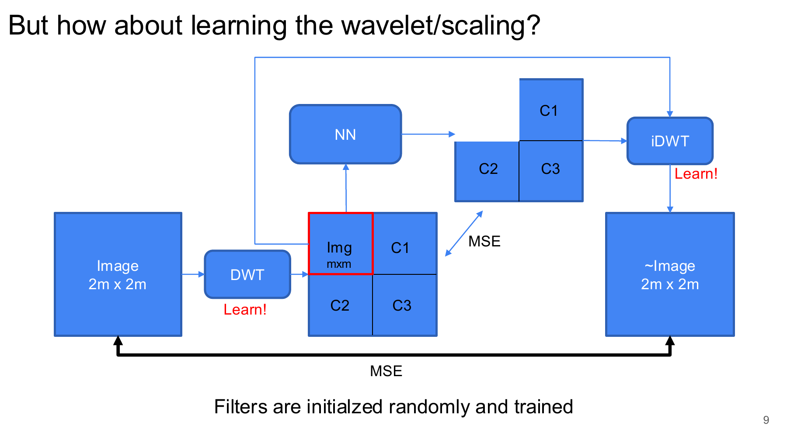
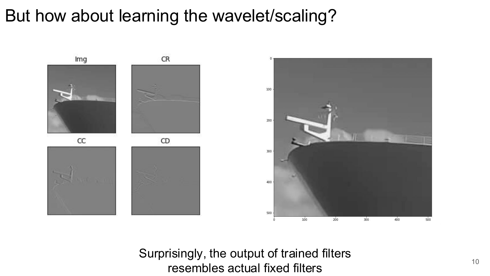
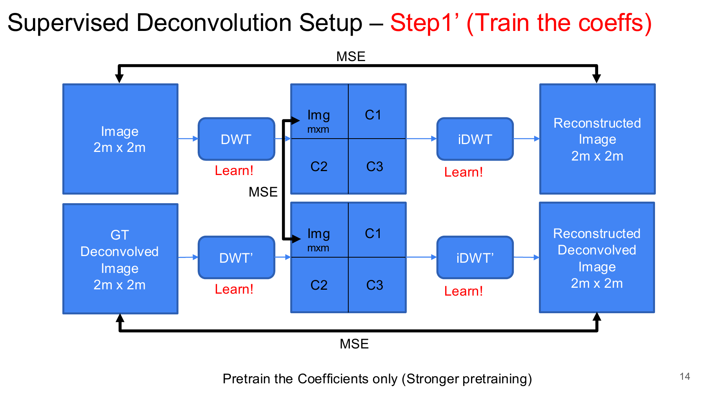
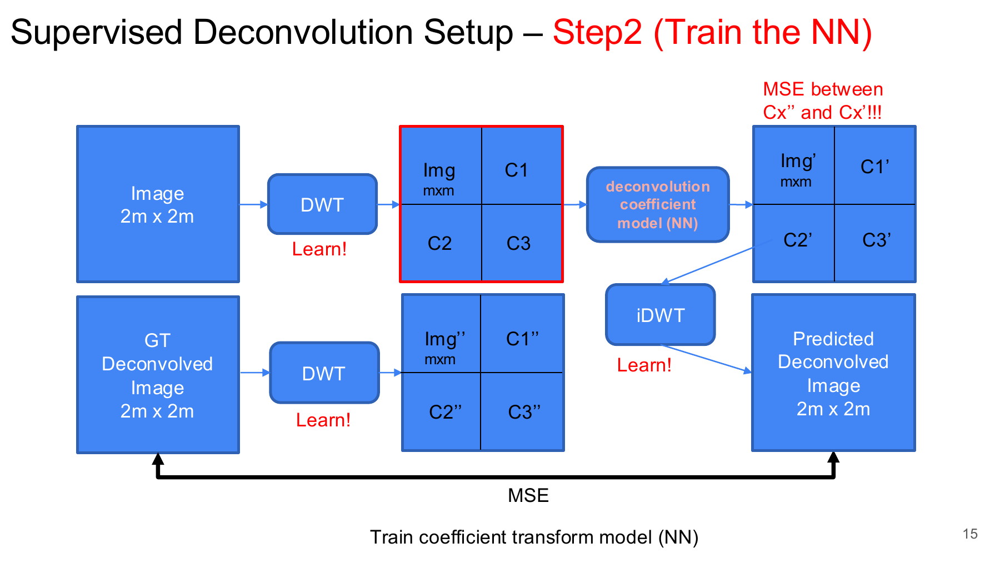
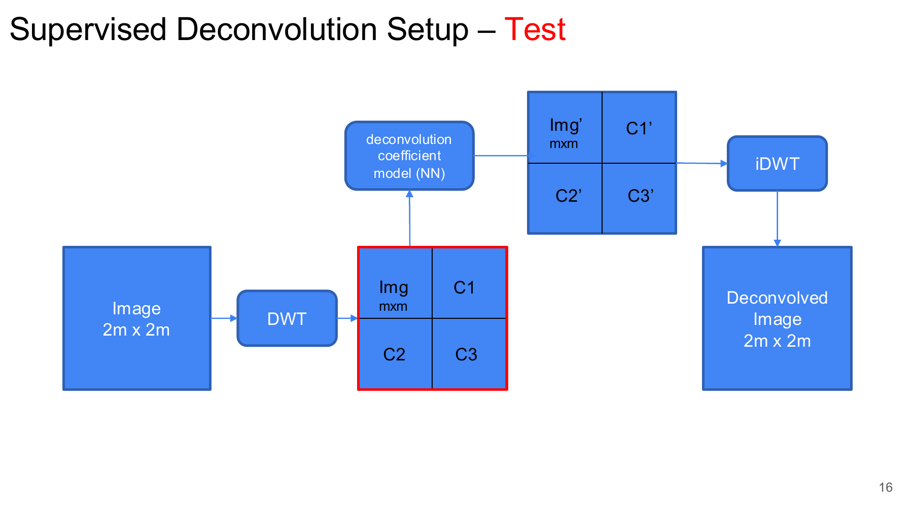
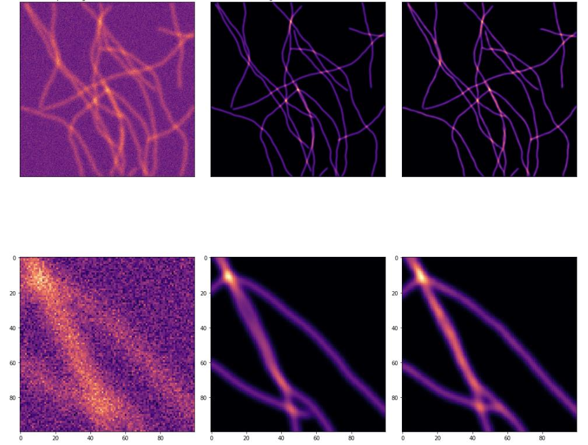
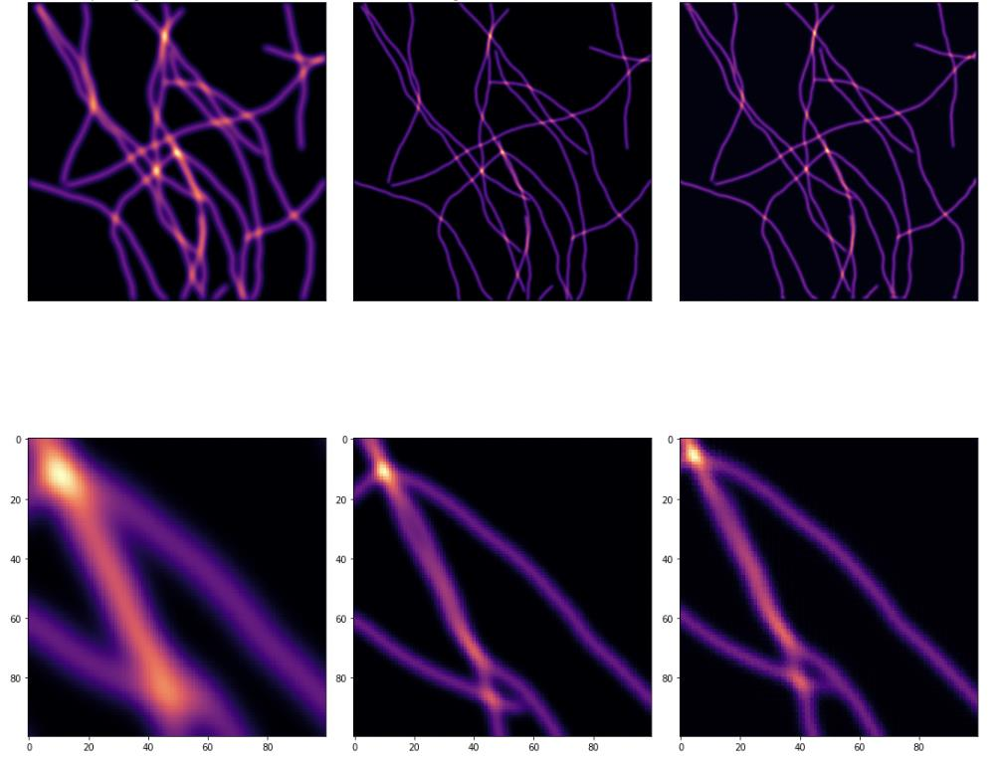
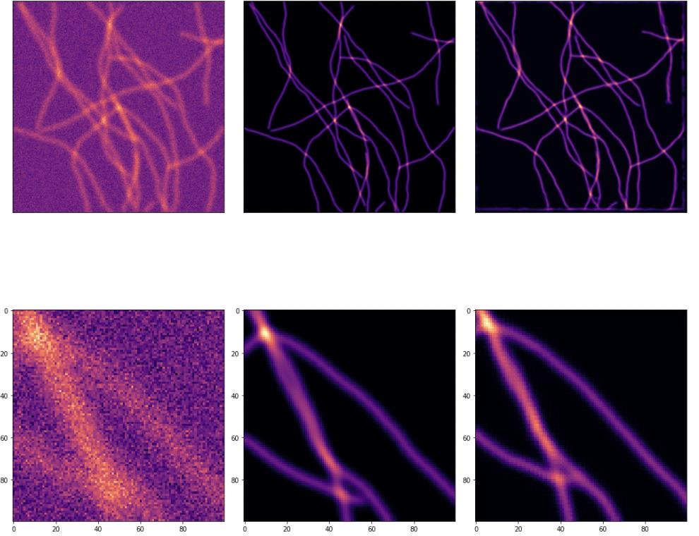
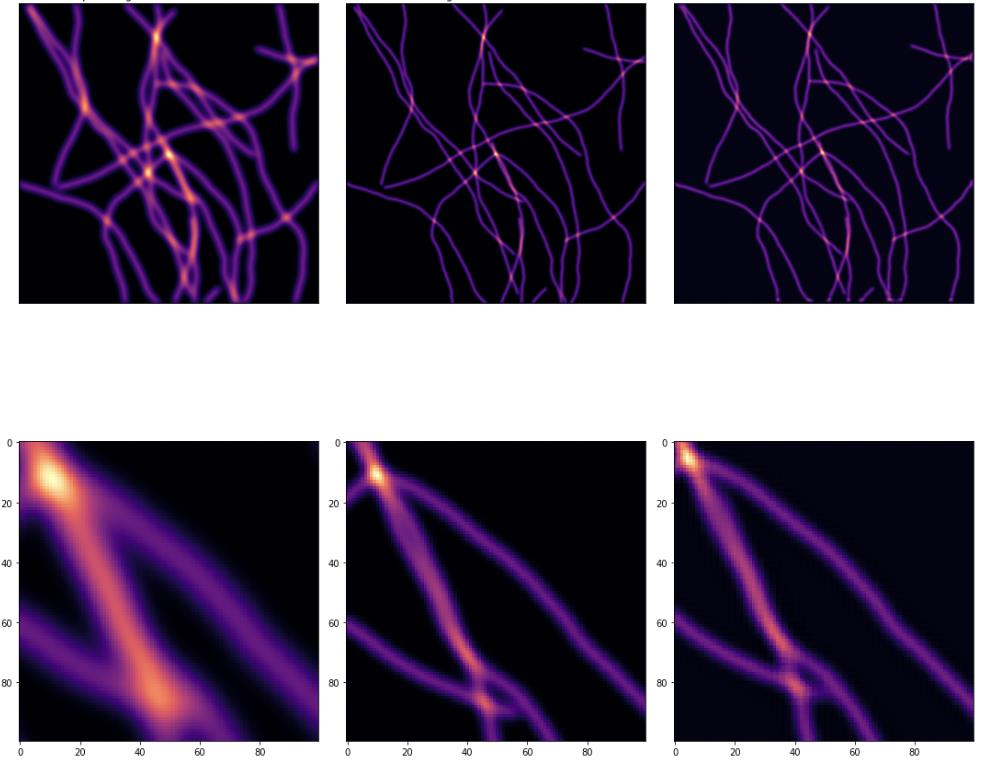
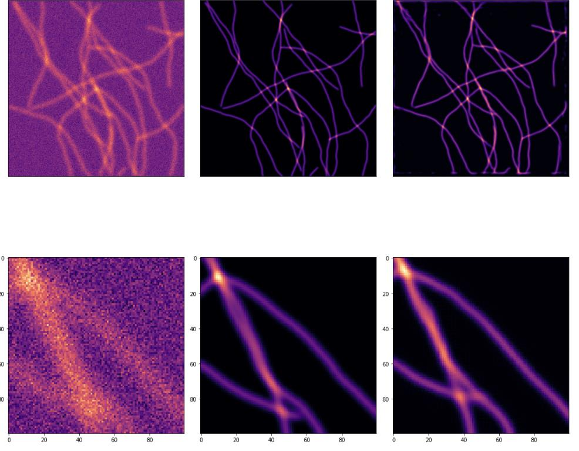

::: {.writeup-page}
[Back to research](index.html#research){.writeup-back .flj}

# DeWaM: Deconvolution Wavelet Model for Microscopy Image Restoration

::: {.writeup-meta}
Early PhD exploration, 2022
:::

::: {.writeup-summary}
This was an early PhD attempt to make microscopy image restoration more structured by moving part of the problem into a learned wavelet domain. Instead of training only a direct image-to-image U-Net, the project asked whether learnable analysis and synthesis wavelet filters could produce a useful coefficient space for deconvolution. The idea was interpretable and technically interesting, but the learned-wavelet models did not outperform the simpler U-Net baseline.
:::

## Motivation

The goal was to restore microscopy images by mapping a degraded or thick input image to a corresponding thin, deconvolved target image. I called this family of models DeWaM, short for Deconvolution Wavelet Model.

The main question was simple: can restoration improve if the model learns a wavelet representation first, rather than doing all prediction directly in pixel space?

The project followed a few stages:

- Start from a fixed wavelet basis.
- Make the wavelet and scaling filters learnable.
- Train a network in the learned coefficient domain.
- Compare the result with a direct U-Net baseline.

## Restoration Task

Each training example contained an input microscopy image and a deconvolved target:

$$
(x_i, y_i),
$$

where $x_i$ denotes the degraded or thick input and $y_i$ denotes the deconvolved target. The experiments also considered a noisy input condition, written as $x_i^n$:

$$
x =
\begin{cases}
x_i, & \text{clean input condition},\\
x_i^n, & \text{noisy input condition}.
\end{cases}
$$

The restoration objective was to learn a function $F_{\theta}$ such that:

$$
\hat{y}_i = F_{\theta}(x_i) \approx y_i.
$$

## Fixed Wavelet Setup

The earlier version used a fixed discrete wavelet transform. The input image was decomposed into wavelet coefficients, a neural network operated on those coefficients, and a fixed inverse wavelet transform reconstructed the output:

$$
C_x = \mathcal{W}_{\mathrm{fixed}}(x),
\qquad
\tilde{C}_y = N_{\theta}(C_x),
\qquad
\hat{y} = \mathcal{W}^{-1}_{\mathrm{fixed}}(\tilde{C}_y).
$$

The image-level loss was:

$$
\mathcal{L}_{\mathrm{img}}
=
\frac{1}{|\Omega|}
\sum_{p\in\Omega}
\left(\hat{y}[p]-y[p]\right)^2.
$$

This setup made the representation structured, but the wavelet basis itself was still fixed.

## Learning the Wavelet Basis

The next idea was to learn the analysis and synthesis filters instead of using a fixed Haar-like basis. The analysis filters were:

$$
\mathbf{h} = (h_0,h_1),
$$

and the synthesis filters were:

$$
\mathbf{g} = (g_0,g_1).
$$

The learned forward and inverse transforms can be written as:

$$
C_x = \mathrm{FWT}_{\mathbf{h}}(x)
=
\begin{bmatrix}
C_x^{LL}\\
C_x^{LH}\\
C_x^{HL}\\
C_x^{HH}
\end{bmatrix},
\qquad
\hat{x} = \mathrm{BWT}_{\mathbf{g}}(C_x).
$$

Here the $LL$ component captures low-frequency structure, while $LH$, $HL$, and $HH$ capture directional high-frequency detail. The hope was that a learned wavelet basis could adapt to microscopy structures better than a hand-chosen transform.

{.writeup-figure fig-align="center"}

One encouraging observation was that the learned filters produced decompositions that resembled meaningful fixed wavelet filters. This suggested the model was not learning arbitrary filters, but it did not yet prove that the representation would improve restoration.

{.writeup-figure fig-align="center"}

## Supervised Deconvolution Setup

The supervised deconvolution experiments were organized into pretraining and coefficient-prediction stages.

In Step 1, the learned transform pair was trained without the coefficient network:

$$
\hat{y}_{\mathrm{step1}}
=
\mathrm{BWT}_{\mathbf{g}}
\left(
\mathrm{FWT}_{\mathbf{h}}(x)
\right),
$$

with the loss:

$$
\mathcal{L}_{\mathrm{step1}}
=
\mathrm{MSE}(\hat{y}_{\mathrm{step1}}, y).
$$

Step 1 Prime strengthened the pretraining by asking the learned transform pair to reconstruct both the input image and the target image:

$$
C_x = \mathrm{FWT}_{\mathbf{h}}(x),
\qquad
C_y = \mathrm{FWT}_{\mathbf{h}}(y),
$$

$$
\mathcal{L}_{\mathrm{step1}^{\prime}}
=
\mathrm{MSE}(\mathrm{BWT}_{\mathbf{g}}(C_x), x)
+
\mathrm{MSE}(\mathrm{BWT}_{\mathbf{g}}(C_y), y).
$$

{.writeup-figure fig-align="center"}

## Coefficient-Space Model

Step 2 trained a neural network to map input wavelet coefficients to target-like wavelet coefficients:

$$
C_x = \mathrm{FWT}_{\mathbf{h}}(x),
\qquad
C_y = \mathrm{FWT}_{\mathbf{h}}(y).
$$

The coefficient model predicted:

$$
\tilde{C}_y = N_{\theta}(C_x),
$$

and the learned inverse transform reconstructed the deconvolved image:

$$
\hat{y}
=
\mathrm{BWT}_{\mathbf{g}}(\tilde{C}_y).
$$

The training loss combined image supervision and coefficient supervision:

$$
\mathcal{L}_{\mathrm{step2}}
=
\mathrm{MSE}(\hat{y}, y)
+
\lambda_{\mathrm{coef}}
\mathrm{MSE}(\tilde{C}_y, C_y).
$$

{.writeup-figure fig-align="center"}

At test time, the target branch was removed. The model used only the input image:

$$
\hat{y}
=
\mathrm{BWT}_{\mathbf{g}}
\left(
N_{\theta}
\left(
\mathrm{FWT}_{\mathbf{h}}(x)
\right)
\right).
$$

{.writeup-figure fig-align="center"}

## Baseline and Result

The comparison baseline was a direct U-Net:

$$
\hat{y}_{\mathrm{base}} = U_{\theta}(x),
$$

trained with the same image-domain mean squared error objective. This baseline was important because it tested whether the learned wavelet representation actually helped beyond a simpler image-to-image restoration model.

| Model | Clean PSNR | Noisy PSNR |
|---|---:|---:|
| Baseline U-Net | **39.43** | **32.73** |
| Step 2 | 37.61 | 28.76 |
| Step 2 Prime | 35.05 | 28.64 |

The numerical result was clear: the direct U-Net was strongest in both clean and noisy settings. The learned-wavelet models were plausible and structured, but in these runs they did not beat direct image-domain restoration.

::: {.wavelet-result-grid}
<figure>

<figcaption>Baseline U-Net, clean input.</figcaption>
</figure>
<figure>

<figcaption>Baseline U-Net, noisy input.</figcaption>
</figure>
<figure>

<figcaption>Step 2, clean input.</figcaption>
</figure>
<figure>

<figcaption>Step 2, noisy input.</figcaption>
</figure>
<figure>

<figcaption>Step 2 Prime, clean input.</figcaption>
</figure>
<figure>

<figcaption>Step 2 Prime, noisy input.</figcaption>
</figure>
:::

## What Did Not Work

The failure mode was not that wavelets were useless. The learned filters did produce meaningful decompositions, and coefficient-space supervision gave a reasonable formulation. The problem was that the full DeWaM pipeline had to learn two things at once: a useful wavelet representation and a coefficient-space deconvolution model.

The U-Net had a simpler job. It could spend all of its capacity on the direct thick-to-thin image mapping. In this experiment, that simpler route won.

The main takeaways were:

- Learned wavelet filters were interpretable, but interpretability alone did not produce better restoration.
- Coefficient supervision made the training objective more structured, but also made the optimization problem more constrained.
- Step 1 Prime did not improve the final result in the reported runs.
- The direct U-Net remained a strong baseline and should not be underestimated.
- This project helped clarify why later work moved toward generative conditional restoration models trained directly around the inverse problem, rather than a separately learned representation pipeline.

So the project did not become a final thesis direction, but it was useful: it tested a clean representation-learning hypothesis and ruled out one tempting route early.
:::
